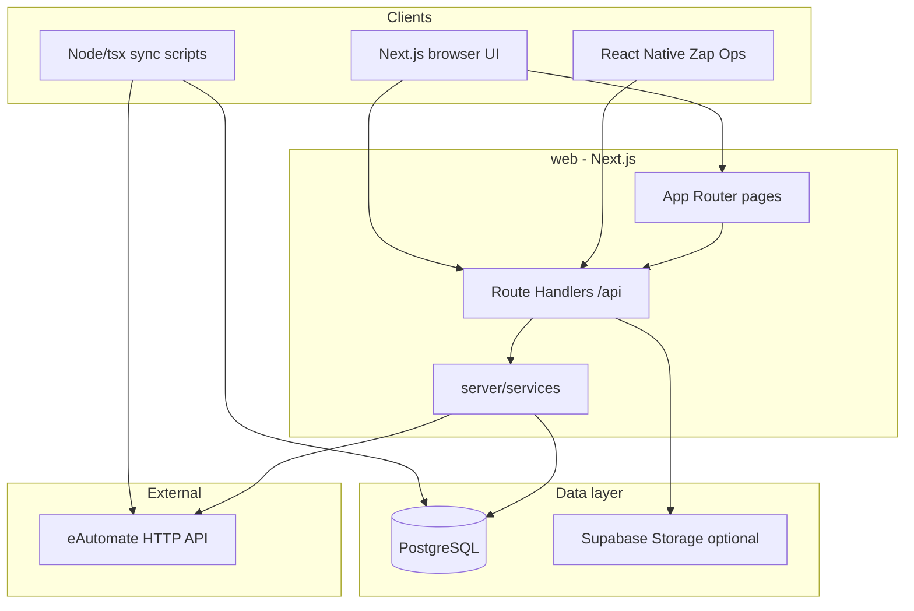

# High-level design (HLD)

## Purpose

**Zap** is an internal operations and catalog platform that mirrors and extends data from **eAutomate** (reference ERP) while storing authoritative state in **PostgreSQL**. The primary deliverable is a **Next.js** web app with **Route Handlers** under `/api`, plus optional **React Native** (Zap Ops) and sync scripts.

## Logical components

## Technology stack

| Layer | Choice |
|-------|--------|
| Web framework | Next.js 16 (App Router) |
| UI | React 19, Tailwind, Radix/shadcn-style components |
| API | Next.js Route Handlers (`route.ts`), JSON + file/binary responses |
| Database | PostgreSQL via `pg` pool; schema from ordered SQL migrations |
| Auth | JWT (`Authorization: Bearer`) and bcrypt-hashed API keys (`X-API-Key`) |
| Authorization | RBAC: `users` → `roles` → `permissions` |
| Files | Supabase Storage for Zap-uploaded blobs; optional legacy eAutomate proxy URLs |
| PDF / labels | `pdf-lib`, `bwip-js` |
| Spreadsheets | `xlsx` for bulk import/export |
| Mobile | React Native (separate package under `mobile/`) |

## Deployment topology (typical)

- **Web**: Vercel or similar Node host; `DATABASE_URL` to managed Postgres (pooler recommended).
- **DB**: Supabase Postgres or any Postgres 14+.
- **Storage**: Supabase Storage buckets when `zap_storage_path` is used for inbound/outbound files.
- **eAutomate**: Outbound HTTPS; cookie/session optional via env (`EAUTOMATE_*`).

## Domain boundaries (coarse)

| Domain | Responsibility |
|--------|----------------|
| Listings / inventory | Master SKUs, secondary listings, bins, warehouse dump, packs/combos |
| Inbound | Vendor POs, GRNs, audits, invoice collection, debit/credit queues |
| Outbound | Channel POs, consignments, attachments, local workflow actions |
| Labels | Master data, product PDF labels, uploads |
| Catalogues | Curated SKU sets, PDF/XLSX export |
| Integrations | eAutomate proxy, sync scripts, public API reference |
| Auth | Login, JWT, API keys, RBAC |

## Non-goals (current system)

- eAutomate is **not** the system of record for Zap-specific workflow state (ack/cancel, local reports) where explicitly decoupled.
- Real-time multi-user collaboration is not a first-class feature (standard HTTP + Postgres).

## See also

- [system-design.md](system-design.md) — request path and module layout
- [api-index.md](api-index.md) — full route list
- [database-schema.md](database-schema.md) — tables and migrations
