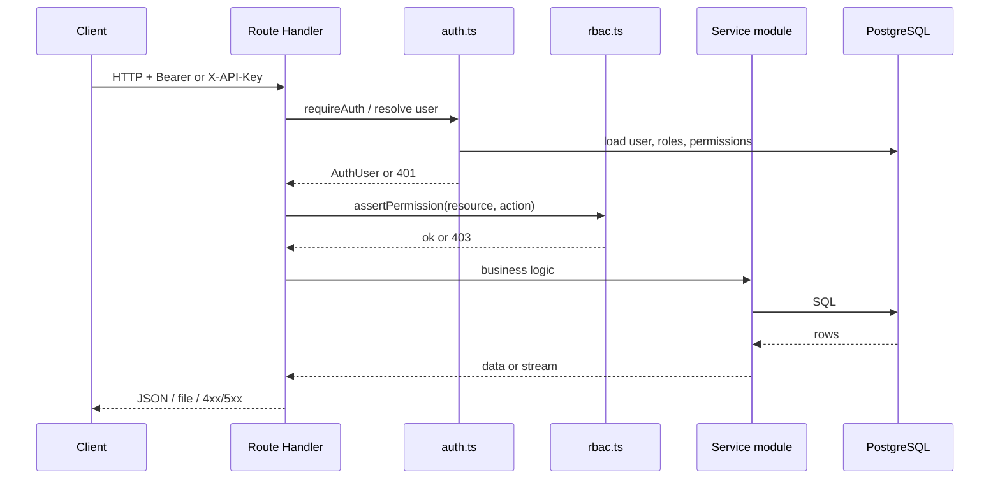

# System design

## Request lifecycle (authenticated API)

**Exceptions:** `POST /api/auth/login` is public (credentials → JWT). Some health-style reads may still require auth depending on route—see [api-index.md](api-index.md).

## Code layout (`web/src`)

| Path | Role |
|------|------|
| `app/(app)/...` | Server and client pages; logistics route groups `(logistics)` for inbound/outbound |
| `app/api/**/route.ts` | HTTP surface; thin handlers, call `server/services` |
| `server/services/*.ts` | Domain logic, SQL, orchestration |
| `server/db.ts` | `pg` pool, `query()` helper |
| `server/auth.ts` | JWT verify, API key lookup, user + permissions load |
| `server/rbac.ts` | Permission checks |
| `server/eautomate-*.ts` | Proxy, session, outbound workflow URL builders, GRN file helpers |
| `server/zapStorage.ts` | Supabase Storage upload/download |
| `server/utils/` | PDF pendency, spreadsheet parse, etc. |
| `components/` | Shared UI (layout shell, shadcn primitives) |
| `lib/` | Client helpers (e.g. API URL, SKU display) |

## Service → API mapping (pattern)

- **One `route.ts` per URL segment** (Next.js App Router convention).
- Handlers **import** functions from `server/services/<domain>Service.ts` or call smaller utilities.
- **Cross-domain** flows (e.g. outbound PO + consignment items) may touch multiple services from one route.

For a complete route list, use [api-index.md](api-index.md). For per-domain detail, see `web/docs/services/<domain>/`.

## Data flow: eAutomate sync (scripts)

Sync scripts under `web/scripts/` use shared helpers (`lib/eautomateAuthFetch.mjs`, etc.) to:

1. Authenticate (cookie / token in env).
2. GET/POST eAutomate public APIs.
3. Normalize and **UPSERT** into Postgres.

The Next.js server can also trigger **on-demand** sync for some entities (e.g. outbound PO detail) when configured.

Operational detail: [../operations/sync-runbook.md](../operations/sync-runbook.md).

## Error model

- `AppError` in `server/errors.ts` maps to JSON `{ error, code?, hint? }` with HTTP status.
- Route handlers use `handleApiError` for consistency.

## See also

- [hld.md](hld.md)
- [../services/eautomate-integration/overview.md](../services/eautomate-integration/overview.md)
