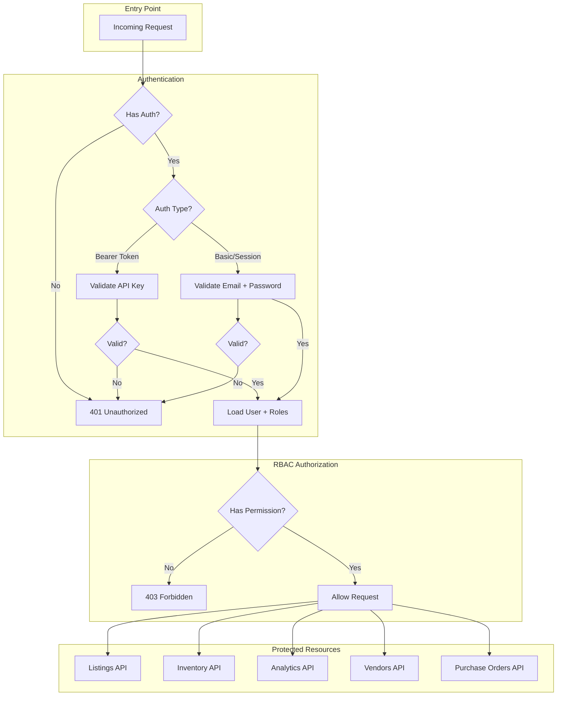

# Auth Flow and RBAC

## Mermaid Flow Diagram

Flow from initial entry point through authentication, RBAC authorization, and protected resources.

## User Behavior Flows

### Email + Password

1. User logs in via `POST /api/auth/login` with `{ email, password }`
2. Server validates credentials and returns JWT
3. Subsequent requests use `Authorization: Bearer <token>`

### API Key

1. Client sends `Authorization: Bearer <api_key>` or `X-API-Key: <api_key>`
2. Server validates against `users.api_key_hash`
3. User and roles are loaded for RBAC checks
