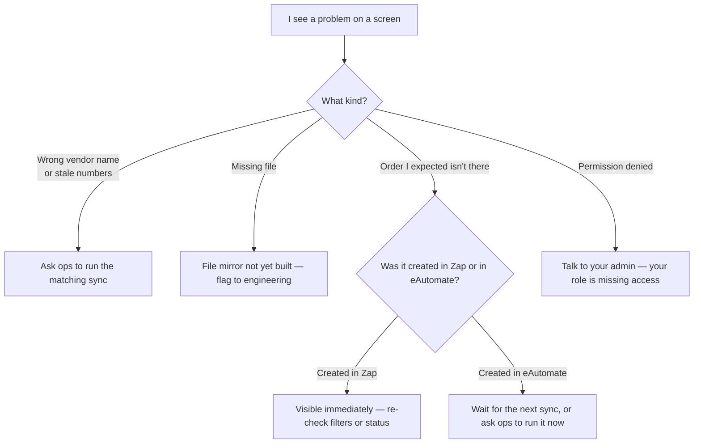
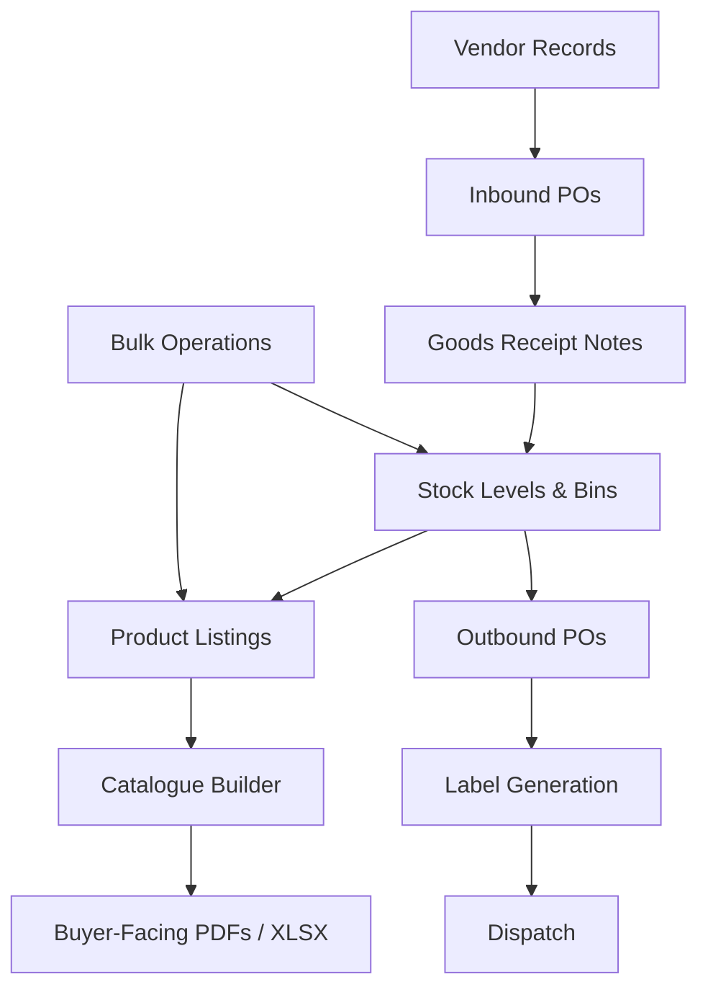
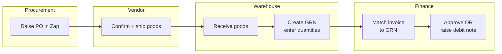
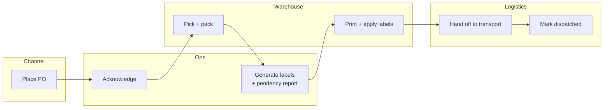
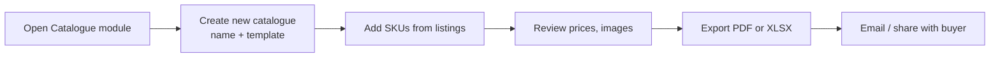
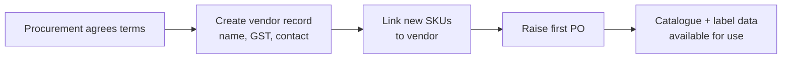
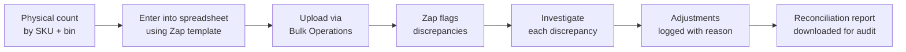
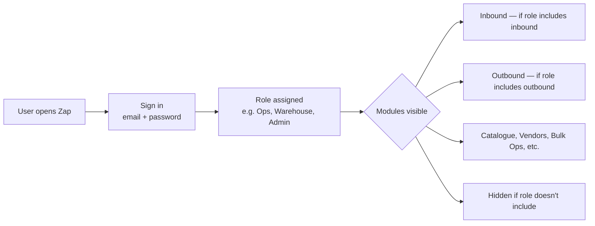
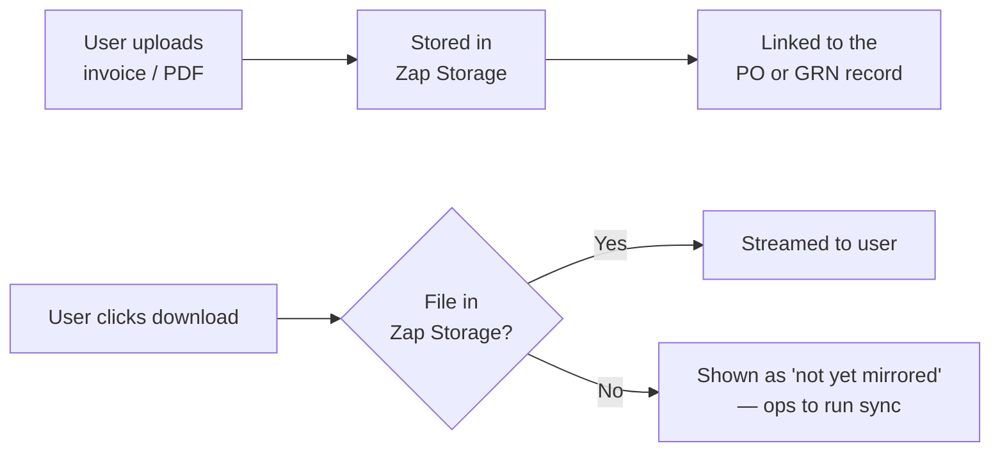
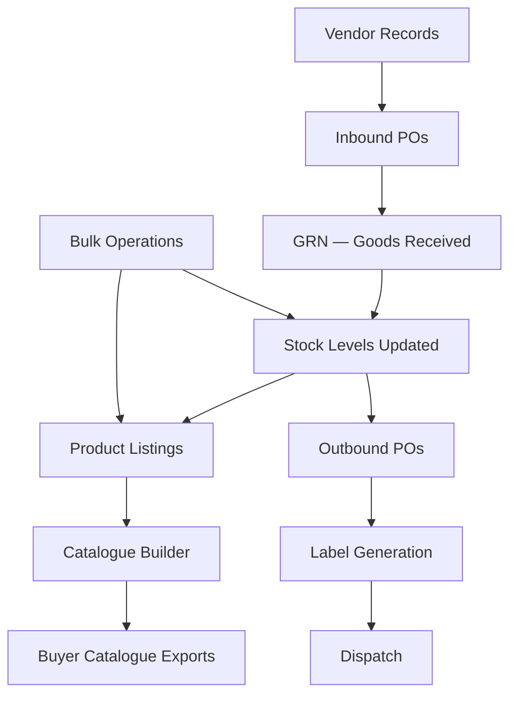

# End-to-End Operational Workflows

**Audience:** Operations, logistics, finance, and business stakeholders
**About this guide:** Plain-language walkthrough of the key business flows in Zap. Every flow has a swimlane diagram showing who does what, followed by step-by-step narrative.

> **Two systems in one sentence**
> *Zap is your operational system — what your teams use day-to-day. eAutomate is the upstream system that originates orders. Zap reads from its own database; data from eAutomate is brought in by scheduled syncs run by ops.*
>
> Engineering audience: the architectural rules behind these flows are in [**../../../../docs/zap-doctrine.md**](../../../../docs/zap-doctrine.md).

---

## How to read this doc

Diagrams use [Mermaid](https://mermaid.live) — they render automatically in GitHub and most modern editors. Each diagram uses **swimlanes**: vertical or horizontal columns showing who is responsible for each step.

### When something looks wrong on screen

---

## How modules connect

Every module shares the same vendor / SKU / stock data — there is no silo.

---

## Workflow 1 — Vendor Order to Stock Receipt (Inbound)

*When your company orders products from a supplier and receives them.*

### Who does what

### Step by step

1. **Procurement raises a Purchase Order (PO)**
   → Sent to vendor (by email or ERP)
   → PO record created in Zap

2. **Vendor confirms and ships**
   → Goods leave vendor's facility

3. **Goods arrive at your warehouse**
   → Warehouse team opens Zap
   → Finds the inbound PO
   → Creates a Goods Receipt Note (GRN)
   → Enters quantities received per SKU
   → Flags any damaged or missing items

   > **What "Pending Audits" means.** When a GRN is received but the quantities haven't been verified yet, it sits on the **Pending Audits** queue. A warehouse auditor opens each GRN, confirms accepted / rejected / shortage quantities line by line, and then marks the audit complete — at which point the GRN moves on to **Pending Invoice Collection**. Until audit is complete, the GRN can't progress to invoice matching or stock update. *(Note: audit is one-way today — there's no UI to send a GRN back from "audited" to "pending" if a mistake is found; flag the IT team for a manual fix.)*

4. **Invoice received from vendor**
   → Uploaded to the GRN in Zap
   → Linked to the correct PO record

5. **Finance reviews**
   → Checks GRN quantities against invoice
   → Raises Debit Note if goods are short or damaged
   → Or approves invoice for payment

6. **Stock levels updated**
   → Zap reflects new stock on hand
   → Bin location recorded for each received SKU

7. **PO marked settled**
   → All records closed and searchable for audit

### Where the data lives in Zap

| What you see on screen | Where it lives in Zap |
|---|---|
| The PO header (vendor, expiry date, SKU list) | Inbound PO record |
| GRN draft and final entries | GRN record + line items |
| Vendor invoice PDFs | Zap Storage (file attachments) |
| Debit / credit notes | DCN records linked to the GRN |

---

## Workflow 2 — Channel Order Fulfilment (Outbound)

*When a sales channel (e.g. Blinkit) places an order and you fulfil it.*

### Who does what

### Step by step

1. **Channel places Purchase Order**
   → PO synced into Zap from eAutomate (next sync run)
   → Ops team sees it in the Outbound POs list

2. **Acknowledgement**
   → Ops team clicks **Acknowledge** in Zap
   → Status changes to In Progress
   → Channel is notified via the upstream system

3. **Warehouse picks and packs**
   → Warehouse team refers to PO line items in Zap
   → Products picked from bin locations
   → Packed into numbered boxes

4. **Box labels generated**
   → Ops team enters box range in Zap (e.g. 1–45)
   → Downloads Phase 1 Box Label PDF
   → Labels printed and attached to each box

5. **Product labels generated** *(if required)*
   → Ops team uses **Generate Product Labels** wizard
   → Selects SKUs, enters quantities
   → Downloads label PDF
   → Labels printed and affixed to units

6. **Goods dispatched**
   → Transport arrives; boxes handed over
   → Ops team marks consignment **Dispatched** in Zap
   → *This is the one moment in the outbound flow when Zap writes back to eAutomate (creating the consignment record upstream).*

7. **Reports generated**
   → SKU Pendency Report downloaded
   → Records filed; any shortfall noted for follow-up

### What Zap does upstream

> Almost everything in this workflow is **read and written inside Zap only**. There is exactly **one** moment Zap reaches out to eAutomate: creating the consignment when goods are dispatched. All other actions — acknowledging, editing PO fields, downloading reports, generating labels — happen entirely in Zap. To refresh the latest channel data, ops runs the outbound sync.

---

## Workflow 3 — Catalogue Creation and Sharing

*When the sales team needs a formatted product catalogue for a buyer meeting.*

### Step by step

1. Merchandiser opens **Catalogue** module in Zap
2. Creates a new catalogue
   → Names it (e.g. "Blinkit Q3 — Kitchenware")
   → Selects a layout template
3. Adds products
   → Searches the product listings
   → Selects required SKUs (images and details auto-filled from listings)
   → Arranges the order
4. Reviews the catalogue
   → Checks all prices, images, and descriptions
   → Makes any last-minute edits
5. Exports
   → Clicks **Export to PDF** (or Excel)
   → File downloads immediately
6. Shares with buyer
   → Sent by email or presented in meeting

**Who is involved:** Sales / Merchandising → Catalogue tool → Buyer

---

## Workflow 4 — New Vendor Onboarding

*When the company starts working with a new supplier.*

### Step by step

1. Procurement agrees terms with new vendor
2. Vendor record created in Zap
   → Name, address, GST number, contact details entered
   → Payment terms noted
3. New SKUs linked
   → Products supplied by this vendor are linked to the vendor record
   → Listing fields (manufacturer, country of origin) filled in
4. First PO raised
   → Purchase Order created against the new vendor
   → PO record in Zap; GRN will be raised on delivery
5. Label and catalogue data ready
   → Because the listing is complete, labels and catalogue pages can be generated immediately

**Who is involved:** Procurement → Vendors module → Merchandising

---

## Workflow 5 — Stock Reconciliation

*When the team needs to verify that physical stock matches system stock.*

### Step by step

1. Warehouse team conducts a physical count
   → Counts units in each bin, SKU by SKU
2. Count results entered into spreadsheet
   → Using Zap's bulk import template
3. Uploaded via **Bulk Operations**
   → Zap compares physical count vs system quantity
   → Discrepancies flagged automatically
4. Discrepancies reviewed
   → Each flagged SKU is investigated
   → Cause identified (e.g. unlisted dispatch, damaged goods, counting error)
5. Adjustments made
   → Corrections entered in Zap
   → Each adjustment logged with reason and user
6. Reconciliation report downloaded
   → Summarises the count, discrepancies found, and adjustments made
   → Filed for audit purposes

**Who is involved:** Warehouse team → Operations → Finance (for audit)

---

## Workflow 6 — Logging in & Permissions

*Who can do what in Zap.*

### Step by step

1. **User opens Zap and signs in** with email and password.
2. **Zap loads their role** (e.g. *Admin*, *Ops*, *Warehouse*, *Finance*, *Vendor*).
3. **The screen adapts** — modules and actions the user is not allowed to use are hidden or disabled. A user only ever sees what their role permits.
4. **API integrations** sign in differently — they use a long-lived API key instead of a password, but otherwise inherit the same role-based limits.

### Common roles

| Role | Typical access |
|---|---|
| Admin | Everything |
| Ops | Inbound + Outbound + Reports |
| Warehouse | GRN entry, picking, label printing |
| Finance | Invoice / DCN review and approval |
| Vendor | Read-only access to their own POs and GRNs |

> If you see "permission denied" or a module you expected is missing, your admin needs to update your role. There is no sync involved.

---

## Workflow 7 — Files & Attachments

*Where uploads live, and what "missing file" now means.*

### Step by step

1. **Uploads** — drag and drop a file (invoice, debit note, attachment) into the relevant PO or GRN. The file is saved in **Zap Storage** and linked to the record.
2. **Downloads** — click any file link. Zap streams it from storage to your browser.
3. **Missing files** — if a file was originally in eAutomate and hasn't been mirrored into Zap Storage yet, you'll see a message saying it's not yet mirrored. Flag it to ops; do not refresh repeatedly. Until the mirror sync runs, the file is unavailable in the UI.

> **What changed:** previously, Zap could fall back to fetching the file directly from eAutomate when it wasn't in storage. That fallback has been removed for consistency and speed. Files now live in Zap Storage only.

---

## Cross-module summary

No module is an island — they all share the same underlying product and stock data, ensuring consistency across every team.

---

*Back to:* [Business Documentation Index](../index.md)
*Engineer-facing version of these flows:* [../../current-system/workflows.md](../../current-system/workflows.md)
*See also:* [Inbound Module](../modules/inbound.md) | [Outbound Module](../modules/outbound.md)
