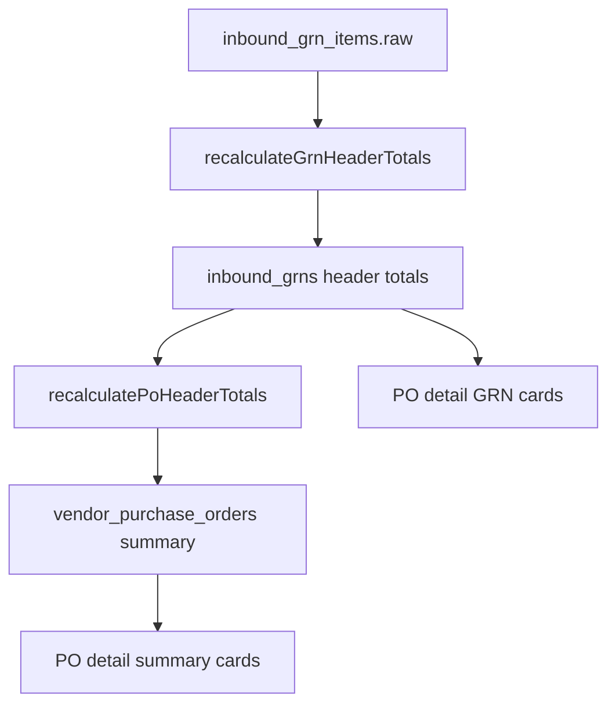

# Inbound field calibration

**Purpose:** For every displayed inbound field, define source of truth, writer, recompute trigger, and UI location.

**Doctrine:** rules #12 (GRN headers) and #13 (PO summary rollups) in [docs/zap-doctrine.md](../../../../docs/zap-doctrine.md).  
**AI skill:** [`.cursor/skills/inbound-workflow-calibration/SKILL.md`](../../../.cursor/skills/inbound-workflow-calibration/SKILL.md).  
**Visual flow:** [/flows](/flows) → GRN Totals & PO Calibration.

---

## Data calibration stack

| Layer | Table | Zap PO | eAutomate PO |
|-------|-------|--------|--------------|
| Lines | `inbound_grn_items` | Warehouse PATCH | Same + sync seed |
| GRN header | `inbound_grns` | Derived from lines | Derived from lines; sync may seed |
| PO summary | `vendor_purchase_orders` | Derived from GRNs | From `sync-eautomate-vendor-pos.mjs` |

**Orchestrator:** `recalculateGrnAndPoHeaderTotals(grnId)` — call after every line write.

---

## GRN header (`inbound_grns`)

| Field | Source of truth | Written by | Recomputed when |
|-------|-----------------|------------|-----------------|
| `grn_sku_count` | `COUNT(inbound_grn_items)` | `recalculateGrnHeaderTotals` | Line seed, line edit, close, audit, migration 071 |
| `grn_invoice_quantity` | `SUM(item invoice qty)` | Same | Same |
| `grn_accepted_quantity` | `SUM(item accepted qty)` | Same | Same |
| `grn_rejected_quantity` | `SUM(item rejected qty)` | Same | Same |
| `grn_shortage_quantity` | `SUM(item shortage qty)` | Same | Same |
| `zap_receipt_exception` | Any rejected/shortage &gt; 0 on lines | Same | Same |
| `grn_status` | Workflow | `createDraftGrnForPo`, `openDraftGrn`, `closeGrn`, sync | — |
| `grn_audit_status` | Workflow | Admin PATCH, sync | — |
| `box_count_invoice`, `actual_box_count_received` | User at GRN create | `createDraftGrnForPo` | — |
| `vendor_invoice_number` | User at GRN create | `createDraftGrnForPo` | — |

**Rule (doctrine #12):** Header quantity columns must match line items after every write. Never trust stale `0` on Zap-created GRNs.

---

## GRN lines (`inbound_grn_items.raw`)

| JSONB key | Writer | UI |
|-----------|--------|-----|
| `invoice_quantity` | Warehouse PATCH | GRN detail sheet |
| `accepted_quantity` | Warehouse PATCH | GRN detail |
| `rejected_quantity` | Warehouse PATCH | GRN detail |
| `shortage_quantity` | Warehouse PATCH | GRN detail |
| `received_price`, `audit_price` | Warehouse / admin audit | GRN detail, pending audits |

Line seed: `seedGrnItemsFromPoDetailLinesIfEmpty` — from `vendor_purchase_order_lines` (Zap PO) or `inbound_po_detail_lines` (eAutomate PO).

---

## PO header (`vendor_purchase_orders`)

| Field | Zap PO | eAutomate PO |
|-------|--------|--------------|
| `sku_count`, `total_quantity` | Canonical PO lines | Canonical + sync |
| `number_of_grns`, `total_invoice_quantity`, `total_accepted_quantity`, `total_rejected_quantity` | Rollup from `inbound_grns` via `recalculatePoHeaderTotals` | From eAutomate sync |
| `quantity_fill_rate` | `accepted ÷ ordered × 100` (0–100%) | From sync |
| `sku_fill_rate` | SKUs with any accepted qty ÷ `sku_count` × 100 | From sync |
| `source` | `zap` | `eautomate` |
| `zap_status` | Cancel overlay in `po_raw` | Optional |

**Rule (doctrine #13):** Zap PO summary cards must match Σ linked GRN headers after every GRN write. eAutomate sync must not overwrite Zap rollups (`WHERE source = 'eautomate'` on PO list UPSERT).

### PO summary card UI (`/inbound/vendors/[id]/purchase-orders/[poId]`)

| Card label | Header field |
|------------|--------------|
| Total SKUs | `sku_count` (ordered; not rolled up) |
| Total required qty | `total_quantity` (ordered; not rolled up) |
| Total received qty | `total_invoice_quantity` |
| Total rejected qty | `total_rejected_quantity` |
| SKU fill rate | `sku_fill_rate` |
| Quantity fill rate | `quantity_fill_rate` |

Fill rates: 0–100% stored values; `quantity_fill_rate = accepted ÷ ordered`; `sku_fill_rate = SKUs with any acceptance ÷ sku_count`.

---

## PO detail GRN card (UI)

Reads merged bundle from `getPoDetailsBundle` → `mergePoGrnSources`:

- Quantities: `grn_sku_count`, `grn_accepted_quantity`, etc. from `inbound_grns`
- Status: `grn_status`, `grn_audit_status` from same row
- Zap-backed link: `raw.zap_origin` in `{zap, draft}`

---

## eAutomate sync vs Zap writes

| Path | Header quantities |
|------|-------------------|
| `sync-eautomate-grns.mjs` | Upserts from upstream API |
| Zap line edit | `recalculateGrnAndPoHeaderTotals` overwrites GRN + Zap PO headers |
| Migration `071` | One-time GRN header backfill |
| Migration `072` | One-time Zap PO summary backfill |

---

## Related

- [inbound-po-grn-workflow.md](inbound-po-grn-workflow.md)
- [inbound-activity-log.md](inbound-activity-log.md)
- [docs/zap-doctrine.md](../../../../docs/zap-doctrine.md) (rules #12–#13)
- [inbound-workflow-calibration skill](../../../.cursor/skills/inbound-workflow-calibration/SKILL.md)
