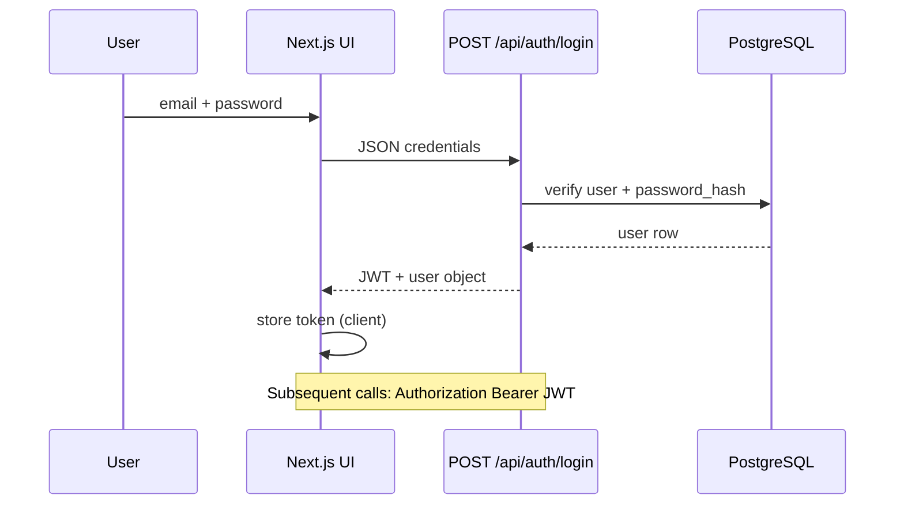
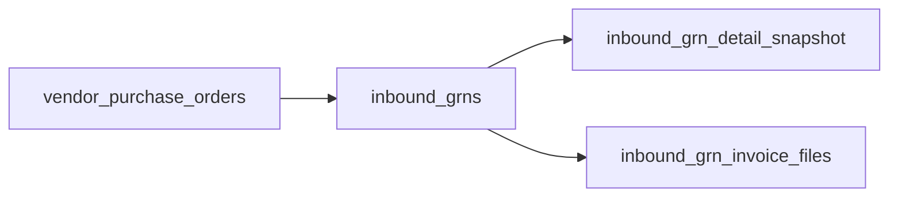
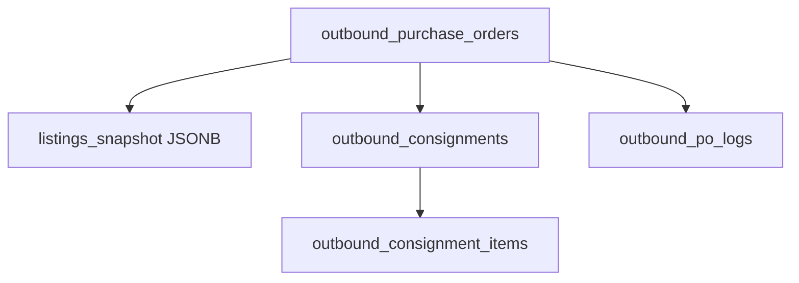

# Current system — workflows

End-to-end flows as implemented today. Diagrams use Mermaid; paste into [mermaid.live](https://mermaid.live) if your editor does not render them.

## 1. User authentication (web)

**API key path (integrations):** clients send `Authorization: Bearer <api_key>` or `X-API-Key: <api_key>`. Server matches against bcrypt hashes in `users.api_key_hash` and loads the same RBAC graph as JWT users.

## 2. Inbound: vendor PO → GRN → detail snapshot

1. **Vendor POs** are listed from Postgres (`vendor_purchase_orders`) and/or synced from eAutomate.
2. User opens **Inbound → GRNs** or vendor-scoped PO/GRN views.
3. **GRN list** reads `inbound_grns`; status updates may PATCH the GRN row.
4. **GRN detail** merges:
   - Local row data
   - Optional **detail snapshot** tables (`inbound_grn_detail_snapshot`, line tables, invoice files)
   - **Ingest** may refresh snapshot from eAutomate (`eautomateGrnDetailsIngestService`).
5. **Files:** invoice/DCN files may be fetched via eAutomate URLs or served from **Zap Storage** when `zap_storage_path` is set (migration `042`).

## 3. Inbound pending queues

Operational queues are backed by dedicated tables or queue tables:

- **Pending audit** — `inbound_grn_pending_audit` (rebuilt on sync).
- **Pending invoice collection** — `inbound_grn_pending_invoice_collection`.
- **Pending debit/credit** — `inbound_pending_debit_credit_notes` (+ per-GRN note tables when ingested).

APIs under `/api/inbound/pending-*` expose paginated lists for the corresponding UI hubs.

## 4. Outbound: PO list → detail → workflow actions

1. **Outbound PO headers** load from `outbound_purchase_orders` with filters (search, WIP, company, delivery, etc.).
2. **PO detail** aggregates:
   - PO row + `listings_snapshot` JSONB (SKU lines from sync or upload)
   - **Consignments** linked to the PO
   - **Attachments** (Zap uploads) and **eAutomate file metadata**
3. **Local workflow** (`POST .../eautomate-actions`): acknowledge, cancel, SKU report, pendency PDF, product labels wizard data, phase-1 box labels PDF — implemented against **Postgres** and local PDF/CSV generators (not upstream eAutomate for those actions).
4. **Consignment line items** may exist in `outbound_consignment_items` (migration `043`) when synced.

## 5. Listings: browse → SKU detail

1. `GET /api/listings/by_page_v4` powers the main grid.
2. SKU detail combines:
   - `listings` row + bins
   - Optional analytics, inbound summary, incoming quantity, outbound summary, listing order lines
3. **Secondary listings** use `secondary_listings` + enrichment JSONB; sync via `sync:secondary-listings`.

## 6. Catalogue export

1. User builds **catalogue_items** in UI.
2. **PDF/XLSX** generated server-side (`catalogueExportService`) and returned as download.

## 7. eAutomate bulk sync (operator)

Scripts under `web/scripts/` (or `npm run sync:eautomate:all`) pull vendors, GRNs, secondary listings, outbound POs, and optional detail ingests. See [../operations/sync-runbook.md](../operations/sync-runbook.md).

## See also

- [../services/inbound/workflows.md](../services/inbound/workflows.md) — inbound deep dive
- [../services/outbound/workflows.md](../services/outbound/workflows.md) — outbound deep dive
- [limitations.md](limitations.md)
