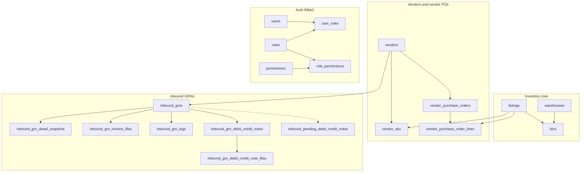

# Database schema (Zap / eCraft)

PostgreSQL schema defined by ordered migrations in [`web/migrations/`](../migrations/). Apply with [`web/scripts/run_migrations.sh`](../scripts/run_migrations.sh) (or `npm run migrate` from `web/` when wired).

**Convention:** `BIGINT` ids often mirror eAutomate external ids. `JSONB` columns store raw API payloads or denormalized blobs for ingest/sync. Timestamps are `TIMESTAMPTZ` unless noted.

### Viewing Mermaid diagrams

The ` ```mermaid ` blocks in this file are **not drawn** in the built-in Markdown preview of VS Code or Cursor unless you add a Mermaid-capable preview (for example the extension **“Markdown Preview Mermaid Support”**). GitHub renders them on the website. You can also paste the fenced block into [mermaid.live](https://mermaid.live) to export PNG/SVG.

If you see only code, use the **ASCII overview** in the next section; it carries the same relationships.

---

## Migration order

| Files | Theme |
|-------|--------|
| `001`–`012` | Warehouses, listings, inventory, vendors, incoming PO lines, caches, secondary listings |
| `013`–`014` | Users, RBAC |
| `015`–`016` | Forms |
| `017`–`021` | Companies, labels, focus lists, catalogues, outbound POs |
| `022`–`024` | RBAC seeds (inbound permissions) |
| `025`–`033` | Inbound GRNs, queues, detail snapshots, SKU cache, documents, logs, pending debit/credit |
| `034` | `secondary_listings` eAutomate enrichment (JSONB + `synced_at`) |
| `035` | `listings.eautomate_bins` JSONB (bin stock from sku_wise_details POST) |
| `036` | `outbound_sold_via`, `outbound_po_attachments` |
| `037` | `outbound_purchase_orders.eautomate_raw`, `eautomate_synced_at`, indexes |
| `038` | `outbound_po_eautomate_files` (PO file metadata from eAutomate) |
| `039` | `outbound_consignments`, `outbound_consignment_delivery_locations` |
| `040` | `outbound_purchase_orders.listings_snapshot` (JSONB cache from eAutomate listings/paginated) |

### Table catalogue

Every `CREATE TABLE` from migrations; use the sections below for columns and indexes.

| Table | Migration |
|-------|-----------|
| `warehouses` | 001 |
| `listings` | 002 |
| `bins` | 003 |
| `sku_analytics` | 004 |
| `pack_combos` | 005 |
| `listing_embeddings` | 006 |
| `warehouse_inventory_dump` | 007 |
| `vendors`, `vendor_specialties`, `vendor_sku` | 008 |
| `listing_order_details` | 009 |
| `inbound_summary` | 010 |
| `incoming_quantity` | 011 |
| `secondary_listings` | 012 (+ `034` columns) |
| `users` | 013 |
| `roles`, `permissions`, `role_permissions`, `user_roles` | 014 |
| `forms` | 015 |
| `form_submissions` | 016 |
| `companies`, `company_secondary_sku` | 017 |
| `labels_master_data` | 018 |
| `focus_lists`, `focus_list_items` | 019 |
| `catalogues`, `catalogue_items` | 020 |
| `delivery_locations`, `outbound_purchase_orders` (+ `companies` columns) | 021 |
| `vendor_purchase_orders`, `vendor_purchase_order_lines` | 023 |
| `inbound_grns` | 025 |
| `inbound_grn_pending_audit` | 026 |
| `inbound_grn_pending_invoice_collection` | 027 |
| `inbound_grn_detail_snapshot`, `inbound_grn_invoice_files`, `inbound_grn_added_items`, `inbound_grn_items` | 028 |
| `inbound_po_detail_snapshot`, `inbound_po_detail_lines`, `inbound_po_detail_grns` | 029 |
| `eautomate_sku_names_cache` (+ `vendors.vendor_contact_number` TEXT) | 030 |
| `inbound_grn_detail_snapshot.grn_api_raw`, `inbound_grn_debit_credit_notes`, `inbound_grn_debit_credit_note_files` | 031 |
| `inbound_grn_logs` | 032 |
| `inbound_pending_debit_credit_notes` | 033 |

Migrations `022`, `024` only insert RBAC rows.

Migration `034` alters `secondary_listings` only (no new table).

---

## Entity overview (high level)

### ASCII (always readable)

```
warehouses ──┐
             ├──► bins ◄── listings
listings ────┘

vendors ──► vendor_sku ◄── listings
vendors ──► vendor_purchase_orders ──► vendor_purchase_order_lines ◄── listings

vendors ──► inbound_grns ──► inbound_grn_detail_snapshot
                        ├──► inbound_grn_invoice_files
                        ├──► inbound_grn_logs
                        ├──► inbound_grn_debit_credit_notes ──► inbound_grn_debit_credit_note_files
                        └──··· inbound_pending_debit_credit_notes   (no FK; dotted = logical grn_id)

users ──► user_roles ◄── roles
roles ──► role_permissions ◄── permissions
```

Below: the same graph in Mermaid (`graph TB`, rectangles only) for tools that render it.



---

## Warehouses and listings core

### `warehouses`

| Column | Type | Notes |
|--------|------|--------|
| `id` | BIGINT | PK |
| `name` | TEXT | |
| `created_at`, `updated_at` | TIMESTAMPTZ | |

### `listings`

Primary SKU / product row (eAutomate-shaped).

| Column | Type | Notes |
|--------|------|--------|
| `id` | BIGINT | PK |
| `sku_id` | VARCHAR(100) | UNIQUE NOT NULL |
| `master_sku`, `inventory_sku_id`, `pack_combo_sku_id` | VARCHAR(100) | |
| `sku_type` | VARCHAR(20) | |
| `inventory_bypass_on` | VARCHAR(5) | |
| `ops_tag` | VARCHAR(50) | |
| `category`, `description`, `meta_fields` | TEXT | |
| `img_hd`, `img_white`, `img_wdim`, `img_link1`, `img_link2` | TEXT | |
| `no_of_constituents` | INT | default 1 |
| `actual_weight` | NUMERIC(10,2) | |
| `dimension`, `keyword_pool`, `material_info` | TEXT | |
| `bulk_price` | NUMERIC(10,2) | |
| `available_quantity` | INT | default 0 |
| `raw_created_at`, `raw_updated_at` | TIMESTAMPTZ | |
| `created_at`, `updated_at` | TIMESTAMPTZ | default NOW() |
| `eautomate_bins` | JSONB | default `[]`; per-bin stock from eAutomate `sku_wise_details` (`listing.bins[]`), filled by `sync-eautomate-secondary-listings.mjs` (`035`) |

### `bins`

| Column | Type | Notes |
|--------|------|--------|
| `id` | BIGINT | PK |
| `warehouse_id` | BIGINT | FK → `warehouses(id)` |
| `sku_id` | VARCHAR(100) | FK → `listings(sku_id)` |
| `bin_id` | VARCHAR(100) | |
| `available_quantity` | INT | default 0 |
| `is_deleted` | BOOLEAN | default FALSE |
| `created_at`, `updated_at` | TIMESTAMPTZ | |

**Unique:** `(warehouse_id, sku_id, bin_id)`.

### `sku_analytics`

Append-only snapshots per fetch.

| Column | Type | Notes |
|--------|------|--------|
| `id` | BIGSERIAL | PK |
| `sku_id` | VARCHAR(100) | FK → `listings(sku_id)` |
| `inward_30d`, `inward_60d`, `inward_90d` | INT | |
| `outward_30d`, `outward_60d`, `outward_90d` | INT | |
| `fetched_at` | TIMESTAMPTZ | default NOW() |

**Index:** `(sku_id, fetched_at)`.

### `pack_combos`

| Column | Type | Notes |
|--------|------|--------|
| `id` | BIGSERIAL | PK |
| `parent_sku_id`, `component_sku_id` | VARCHAR(100) | FK → `listings(sku_id)` |
| `quantity` | INT | default 1 |
| `created_at` | TIMESTAMPTZ | |

### `listing_embeddings`

| Column | Type | Notes |
|--------|------|--------|
| `id` | BIGSERIAL | PK |
| `sku_id` | VARCHAR(100) | FK → `listings(sku_id)` |
| `embedding_text` | TEXT | |
| `embedding` | DOUBLE PRECISION[] | |
| `created_at` | TIMESTAMPTZ | |

### `warehouse_inventory_dump`

| Column | Type | Notes |
|--------|------|--------|
| `id` | BIGSERIAL | PK |
| `warehouse_id` | BIGINT | FK → `warehouses(id)` |
| `sku_id` | VARCHAR(100) | FK → `listings(sku_id)` |
| `inventory_operation_type` | VARCHAR(20) | |
| `quantity` | INT | |
| `bin_id`, `user_id` | VARCHAR(100) | |
| `created_at`, `updated_at` | TIMESTAMPTZ | |

**Indexes:** `sku_id`, `created_at DESC`.

### `inbound_summary` / `incoming_quantity`

Cache tables keyed by SKU.

| Table | Extra columns |
|-------|----------------|
| `inbound_summary` | `summary_date` DATE, `quantity` INT, `source` TEXT, `raw_data` JSONB, `fetched_at` |
| `incoming_quantity` | `quantity` INT, `expected_date` DATE, `source` TEXT, `raw_data` JSONB, `fetched_at` |

Both: `sku_id` → `listings(sku_id)`, index on `sku_id`.

### `secondary_listings`

| Column | Type | Notes |
|--------|------|--------|
| `id` | BIGINT | PK (eAutomate row id when synced from API) |
| `secondary_sku` | VARCHAR(200) | NOT NULL |
| `master_sku`, `inventory_sku_id`, `pack_combo_sku_id` | VARCHAR(100) | |
| `sku_type` | VARCHAR(20) | |
| `inventory_bypass_status` | VARCHAR(20) | |
| `ais_quantity`, `available_quantity` | INT | |
| `company_details` | JSONB | default `[]`; `secondary_sku_company_details` from eAutomate (`034`) |
| `labels_data` | JSONB | default `{}`; `secondary_sku_labels_data` (`034`) |
| `sku_wise_details_raw` | JSONB | default `{}`; full POST `sku_wise_details` response (`034`) |
| `synced_at` | TIMESTAMPTZ | Last successful SKU-wise sync (`034`) |

**Indexes:** `secondary_sku`, `master_sku`, `inventory_sku_id`.

**Sync:** `npm run sync:secondary-listings` → [`scripts/sync-eautomate-secondary-listings.mjs`](../scripts/sync-eautomate-secondary-listings.mjs) (GET paginated + POST per row); also upserts `labels_master_data` from labels payload.

---

## Vendors and incoming purchase order lines

### `vendors`

| Column | Type | Notes |
|--------|------|--------|
| `id` | BIGINT | PK |
| `vendor_name` | VARCHAR(200) | |
| `created_by`, `modified_by` | VARCHAR(100) | |
| `created_at`, `updated_at` | TIMESTAMPTZ | |
| Address / tax / contact | `vendor_address_line` TEXT, `vendor_city`, `vendor_state`, `vendor_postal_code`, `vendor_gstin`, `vendor_contact_number` TEXT (widened in `030`) | |

### `vendor_specialties`

| Column | Type | Notes |
|--------|------|--------|
| `id` | BIGINT | PK |
| `vendor_id` | BIGINT | FK → `vendors(id)` |
| `vendor_speciality` | VARCHAR(100) | |
| `created_by`, `modified_by` | VARCHAR(100) | |
| `created_at`, `updated_at` | TIMESTAMPTZ | |

**Index:** `vendor_id`.

### `vendor_sku`

| Column | Type | Notes |
|--------|------|--------|
| `id` | BIGINT | PK |
| `vendor_id` | BIGINT | FK → `vendors(id)` |
| `sku_id` | VARCHAR(100) | FK → `listings(sku_id)` |
| `cost_price` | NUMERIC(12,2) | |
| `modified_by` | VARCHAR(100) | |
| `created_at`, `updated_at` | TIMESTAMPTZ | |

**Unique:** `(vendor_id, sku_id)`. **Index:** `sku_id`.

### `listing_order_details`

Denormalized incoming PO lines per SKU (eAutomate listing order API).

| Column | Type | Notes |
|--------|------|--------|
| `id` | BIGINT | PK |
| `po_number` | VARCHAR(50) | |
| `po_secondary_sku` | VARCHAR(100) | FK → `listings(sku_id)` |
| `master_sku`, `inventory_sku_id`, `pack_combo_sku_id`, `sku_type` | | |
| `company_code_primary`, `company_code_secondary` | VARCHAR(50) | |
| `demand` | INT | |
| `hsn_code`, `size`, `color` | | |
| `title` | TEXT | |
| `mrp`, `rate_without_tax`, `tax_rate` | numeric | |
| `created_by` | VARCHAR(100) | |
| `created_at`, `updated_at` | TIMESTAMPTZ | |
| `dispatched_quantity`, `packed_quantity` | INT | |
| `company_name`, `delivery_city` | | |
| `po_issue_date`, `expiry_date` | TIMESTAMP | |
| `po_type`, `calculated_po_status` | VARCHAR(50) | |

**Index:** `po_secondary_sku`.

---

## Inbound vendor purchase orders

### `vendor_purchase_orders`

| Column | Type | Notes |
|--------|------|--------|
| `po_id` | BIGINT | PK |
| `vendor_id` | BIGINT | FK → `vendors(id)` ON DELETE RESTRICT |
| `vendor_name` | VARCHAR(200) | |
| `expected_date` | DATE | |
| `created_by`, `modified_by` | VARCHAR(100) | |
| `created_at`, `updated_at` | TIMESTAMPTZ | |
| `date_published` | TIMESTAMPTZ | |
| `status` | VARCHAR(50) | default `PENDING` |
| `po_remarks` | TEXT | |
| `sku_count`, `total_quantity`, `number_of_grns` | INT | |
| `total_invoice_quantity`, `total_accepted_quantity`, `total_rejected_quantity` | INT | |
| `sku_fill_rate`, `quantity_fill_rate` | NUMERIC(10,2) | |

**Index:** `(vendor_id, created_at DESC)`.

### `vendor_purchase_order_lines`

| Column | Type | Notes |
|--------|------|--------|
| `id` | BIGSERIAL | PK |
| `po_id` | BIGINT | FK → `vendor_purchase_orders(po_id)` CASCADE |
| `sku_id` | VARCHAR(100) | FK → `listings(sku_id)` |
| `quantity` | INT | CHECK > 0 |
| `created_at` | TIMESTAMPTZ | |

**Unique:** `(po_id, sku_id)`. **Index:** `po_id`.

---

## Inbound GRNs and related

### `inbound_grns`

Synced from eAutomate GRN list APIs. `po_id` is **not** declared as FK to `vendor_purchase_orders` in SQL (logical link only).

| Column | Type | Notes |
|--------|------|--------|
| `grn_id` | BIGINT | PK |
| `po_id` | BIGINT | NOT NULL |
| `vendor_id` | BIGINT | FK → `vendors(id)` ON DELETE RESTRICT |
| `vendor_name` | VARCHAR(200) | |
| `grn_status`, `grn_audit_status` | VARCHAR(80) | |
| `grn_audit_by`, `grn_invoice_collection_by` | VARCHAR(100) | |
| `grn_invoice_collection_status` | VARCHAR(80) | |
| `vendor_invoice_number` | VARCHAR(200) | |
| `box_count_invoice`, `actual_box_count_received` | INT | |
| `grn_sku_count`, `grn_invoice_quantity`, `grn_accepted_quantity`, `grn_rejected_quantity`, `grn_shortage_quantity` | INT | |
| `po_sku_count`, `po_total_quantity` | INT | |
| `created_by` | VARCHAR(100) | |
| `created_at`, `updated_at` | TIMESTAMPTZ | |

**Indexes:** `(vendor_id, created_at DESC)`, `po_id`, `created_at DESC`.

### `inbound_grn_pending_audit` / `inbound_grn_pending_invoice_collection`

| Table | Columns |
|-------|---------|
| `inbound_grn_pending_audit` | `grn_id` PK, FK → `inbound_grns(grn_id)` CASCADE |
| `inbound_grn_pending_invoice_collection` | same |

Rebuilt on each respective sync (truncate + insert).

### `inbound_grn_detail_snapshot`

| Column | Type | Notes |
|--------|------|--------|
| `grn_id` | BIGINT | PK, FK → `inbound_grns` CASCADE |
| `po_id`, `vendor_id` | BIGINT | |
| `vendor_display_name`, `vendor_address` | TEXT | |
| `vendor_gstin` | VARCHAR(50) | |
| `vendor_contact` | TEXT | |
| `po_total_demand` | INT | |
| `po_release_date`, `po_expiry_date` | DATE | |
| `po_created_by` | VARCHAR(100) | |
| `grn_box_count_invoice`, `grn_actual_boxes` | INT | |
| `grn_opened_by` | VARCHAR(100) | |
| `grn_created_at`, `grn_updated_at` | TIMESTAMPTZ | |
| `synced_at` | TIMESTAMPTZ | |
| `po_raw`, `vendor_raw`, `grn_header_raw` | JSONB | |
| `grn_api_raw` | JSONB | added in `031` (live GRN GET payload) |

**Indexes:** `po_id`, `vendor_id`.

### `inbound_grn_invoice_files`

| Column | Type | Notes |
|--------|------|--------|
| `grn_id`, `file_id` | BIGINT | PK `(grn_id, file_id)` |
| `file_type` | VARCHAR(80) | |
| `file_name` | TEXT | |
| `uploaded_at` | TIMESTAMPTZ | |
| `uploaded_by` | VARCHAR(100) | |
| `download_url` | TEXT | |
| `raw` | JSONB | |

**Index:** `grn_id`.

### `inbound_grn_added_items` / `inbound_grn_items`

| Column | Type | Notes |
|--------|------|--------|
| `grn_id` | BIGINT | FK → `inbound_grns` CASCADE |
| `line_index` | INT | part of PK |
| `sku_id` | VARCHAR(100) | |
| `raw` | JSONB | |

**PK:** `(grn_id, line_index)`. **Index:** `grn_id`.

### `inbound_grn_debit_credit_notes` (per-GRN, from detail ingest)

| Column | Type | Notes |
|--------|------|--------|
| `grn_id`, `note_id` | BIGINT | PK |
| `po_id` | BIGINT | |
| Note / status / upload fields | VARCHAR / TEXT | same names as pending table (incl. `actual_box_count_recieved`) |
| `raw` | JSONB | |

**Index:** `grn_id`.

### `inbound_grn_debit_credit_note_files`

| Column | Type | Notes |
|--------|------|--------|
| `grn_id`, `note_id`, `file_id` | BIGINT | PK |
| `file_type`, `file_name`, `saved_file_name`, `file_path` | | |
| `uploaded_at`, `uploaded_by`, `download_url` | | |
| `raw` | JSONB | |

**FK:** `(grn_id, note_id)` → `inbound_grn_debit_credit_notes`. **Index:** `grn_id`.

### `inbound_grn_logs`

| Column | Type | Notes |
|--------|------|--------|
| `grn_id`, `log_id` | BIGINT | PK |
| `line_index` | INT | NOT NULL |
| `log_type` | VARCHAR(80) | |
| `operation_performed` | TEXT | |
| `po_id`, `vendor_id`, `foreign_key` | BIGINT | |
| `sku_id` | VARCHAR(100) | |
| `invoice_quantity`, `accepted_quantity`, `rejected_quantity` | INT | |
| `received_price` | NUMERIC(14,2) | |
| `remarks` | TEXT | |
| `created_by` | VARCHAR(100) | |
| `created_at`, `updated_at` | TIMESTAMPTZ | |
| `raw` | JSONB | |

**Index:** `(grn_id, created_at DESC NULLS LAST)`.

### `inbound_pending_debit_credit_notes`

Global pending list from paginated API; **full replace** on sync.

| Column | Type | Notes |
|--------|------|--------|
| `note_id` | BIGINT | PK |
| `grn_id` | BIGINT | NOT NULL |
| Typed note + GRN summary columns | | aligned with API (incl. `actual_box_count_recieved`) |
| `vendor_id`, `vendor_name` | | |
| `raw` | JSONB | |
| `synced_at` | TIMESTAMPTZ | |

**Indexes:** `grn_id`, `vendor_id`, `updated_at DESC`.

---

## PO detail snapshot (ingest)

### `inbound_po_detail_snapshot`

| Column | Type | Notes |
|--------|------|--------|
| `po_id` | BIGINT | PK |
| `vendor_id` | BIGINT | |
| `synced_at` | TIMESTAMPTZ | |
| `vendor_raw`, `po_raw` | JSONB | |
| `vendor_listings_raw`, `sku_names_raw` | JSONB | arrays |

**Index:** `vendor_id`.

### `inbound_po_detail_lines`

**PK:** `(po_id, line_index)`. `po_id` FK → snapshot CASCADE. `sku_id`, `raw` JSONB. **Index:** `sku_id`.

### `inbound_po_detail_grns`

**PK:** `(po_id, sort_index)`. `grn_id`, `raw` JSONB. **Index:** `grn_id`.

---

## eAutomate cache

### `eautomate_sku_names_cache`

Single-row cache (`id = 1`): `payload` JSONB, `synced_at` TIMESTAMPTZ.

---

## Auth and RBAC

### `users`

| Column | Type | Notes |
|--------|------|--------|
| `id` | BIGSERIAL | PK |
| `email` | VARCHAR(255) | UNIQUE NOT NULL |
| `password_hash`, `api_key_hash` | VARCHAR(255) | |
| `created_at`, `updated_at` | TIMESTAMPTZ | |

**Indexes:** `email`, partial on `api_key_hash` WHERE NOT NULL.

### `roles` / `permissions`

- `roles`: `id` SERIAL PK, `name` UNIQUE, `description`.
- `permissions`: `id` SERIAL PK, `resource`, `action`, UNIQUE `(resource, action)`.

### `role_permissions`

`(role_id, permission_id)` PK, FKs CASCADE on delete.

### `user_roles`

`(user_id, role_id)` PK, FKs to `users` / `roles` CASCADE.

**Indexes:** `user_roles(user_id)`, `role_permissions(role_id)`.

Migrations `022`, `024` insert permission rows and `warehouse_manager` role links (no new tables).

---

## Forms

### `forms`

| Column | Type | Notes |
|--------|------|--------|
| `id` | SERIAL | PK |
| `category`, `sub_category` | VARCHAR(100) | UNIQUE pair |
| `form_name` | VARCHAR(255) | |
| `form_payload` | JSONB | default `[]` |
| `created_by` | VARCHAR(100) | |
| `is_active` | INT | default 1 |
| `version` | INT | default 1 |
| `created_at`, `updated_at` | TIMESTAMPTZ | |

### `form_submissions`

| Column | Type | Notes |
|--------|------|--------|
| `id` | BIGSERIAL | PK |
| `form_id` | INT | FK → `forms` CASCADE |
| `user_id` | VARCHAR(255) | |
| `submission_date` | DATE | |
| `payload` | JSONB | |
| `created_at`, `updated_at` | TIMESTAMPTZ | |

**Unique:** `(form_id, user_id, submission_date)`. **Indexes:** `(form_id, submission_date)`, `(user_id, submission_date)`.

---

## Companies and channel SKUs

### `companies`

| Column | Type | Notes |
|--------|------|--------|
| `id` | BIGINT | PK |
| `name` | VARCHAR(200) | |
| `code_primary` | VARCHAR(50) | |
| `created_at`, `updated_at` | TIMESTAMPTZ | |
| `attributes` | JSONB | `021` |
| `is_active` | SMALLINT | default 1 |

**Index:** `code_primary`.

### `company_secondary_sku`

`company_id` FK CASCADE, `secondary_sku` VARCHAR(200), UNIQUE `(company_id, secondary_sku)`. Indexes on `secondary_sku`, `company_id`.

---

## Labels, focus lists, catalogues

### `labels_master_data`

`secondary_sku` UNIQUE, EAN / size / color / material / MRP / `one_set_contains`, timestamps.

### `focus_lists` / `focus_list_items`

Curated lists; items: `focus_list_id` FK CASCADE, `sku_id` FK `listings` CASCADE, UNIQUE `(focus_list_id, sku_id)`.

### `catalogues` / `catalogue_items`

`catalogue_type` CHECK `standard` | `custom`. Items: `catalogue_id` FK CASCADE, `sku_id` FK `listings` CASCADE, `sort_order`, `moq`, `display_price`, UNIQUE `(catalogue_id, sku_id)`.

---

## Outbound (sales) purchase orders

### `delivery_locations`

`id` SERIAL PK, `name` VARCHAR(200) UNIQUE.

### `outbound_purchase_orders`

| Column | Type | Notes |
|--------|------|--------|
| `id` | BIGINT | PK |
| `sold_via` | VARCHAR(80) | |
| `company_id` | BIGINT | FK → `companies` SET NULL |
| `po_number` | VARCHAR(80) | UNIQUE |
| `delivery_city`, `delivery_address`, `billing_address` | | |
| `buyer_gstin` | VARCHAR(32) | |
| `po_issue_date`, `expiry_date` | TIMESTAMPTZ | |
| `po_type`, `po_creation_status`, `po_acknowledgement_status`, `po_fulfillment_status` | VARCHAR(80) | |
| `created_by` | VARCHAR(120) | |
| `created_at`, `updated_at` | TIMESTAMPTZ | |
| `is_wip` | VARCHAR(10) | |
| `remarks` | TEXT | |
| `company_name` | VARCHAR(220) | |
| `analytics_object` | JSONB | default `{}` |
| `listings_snapshot` | JSONB | default `{}`; paginated SKU lines from `GET .../incoming_purchase_orders/listings/paginated/{po_number}` (`040`) |
| `calculated_po_status` | VARCHAR(120) | |
| `eautomate_raw` | JSONB | default `{}`; last full row from eAutomate partial PO sync (`037`) |
| `eautomate_synced_at` | TIMESTAMPTZ | last successful upsert from `sync-eautomate-outbound-partial-pos.ts` |

**Indexes:** `created_at DESC`, `company_id`, `delivery_city`, `is_wip`, `calculated_po_status`, `po_creation_status`, `eautomate_synced_at DESC`.

See also `outbound_sold_via`, `outbound_po_attachments` (`036`).

### `outbound_po_eautomate_files` (`038`)

Rows from `GET .../incoming_purchase_orders/fetch_po_detail_files/{po_number}`. PK `eautomate_file_id`; FK `outbound_po_id` → `outbound_purchase_orders` CASCADE. Columns mirror API: `po_number`, optional `consignment_id` / `invoice_id` / `appointment_id`, `file_type`, `file_name`, `saved_file_name`, `file_path`, `file_uploaded_by`, timestamps, `raw` JSONB.

### `outbound_consignments` (`039`)

Ingested from `POST .../incoming_purchase_orders/consignments/all/paginated`. PK `id` (eAutomate consignment id). Denormalized columns for list/sort (company, location, PO, invoice fields, counts, transporter, vehicle/docket, RTD timestamps, etc.) plus **`raw` JSONB** with the full upstream object (all keys preserved). FK `company_id` → `companies` (nullable if unknown).

### `outbound_consignment_delivery_locations` (`039`)

From `GET .../incoming_purchase_orders/delivery_locations`. `name` UNIQUE, `sort_order`, `raw` JSONB, `synced_at`.

---

## Source of truth

Authoritative DDL lives in [`web/migrations/*.sql`](../migrations/). This document is a human-readable map; if they diverge, prefer the migration files.
