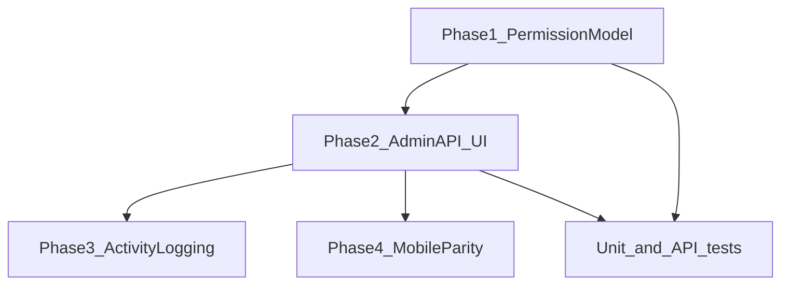

# Technical Implementation Plan

**Status:** DRAFT FOR REVIEW  
**Last updated:** 2026-07-02  
**Audience:** Backend and frontend engineers  
**Related:** [Permission catalog](02-permission-catalog.md) · [UI spec](03-role-management-ui.md) · [Auth service](../../services/auth/overview.md)

---

## Overview

Implementation is split into four phases after business sign-off. Phases 1–2 can ship together; phase 3 (logging) should accompany phase 2; phase 4 (mobile) can follow web GA.



---

## Phase 1 — Permission model & API gates

### Migration

**File:** `web/migrations/078_rbac_fine_grained_permissions.sql` (name TBD)

1. **Insert new permission rows:**

```sql
INSERT INTO permissions (resource, action, description) VALUES
  ('listings', 'create', 'Create master SKU listings'),
  ('listings', 'delete', 'Soft-delete master listings'),
  ('grn', 'audit', 'Mark GRN audit complete'),
  ('grn', 'accounts_approve', 'Approve or reject GRN accounts'),
  ('grn', 'invoice_collect', 'Mark GRN vendor invoice collected'),
  ('debit_credit', 'decide', 'Accept or decline pending debit/credit notes')
ON CONFLICT (resource, action) DO NOTHING;
```

2. **Insert proposed roles** (if not exists):

```sql
INSERT INTO roles (name, description) VALUES
  ('inventory_management', 'Inventory — stock, bins, GRN receipt, listings read'),
  ('ops_management', 'Operations — outbound + inventory management + listings read'),
  ('qc', 'QC — listings read + inbound inspection')
ON CONFLICT (name) DO NOTHING;
```

Note: `finance` role already exists — extend its `role_permissions` rather than creating duplicate.

3. **Seed default `role_permissions`** per [02-permission-catalog.md](02-permission-catalog.md) (confirmed bundles + flagged defaults).

4. **Do not delete** legacy roles or existing `role_permissions` rows.

### Replace hard-coded authorization

| File | Current | Change |
|------|---------|--------|
| [inbound/grns/[grnId]/route.ts](../../../src/app/api/inbound/grns/[grnId]/route.ts) | `user.roles.includes("admin")` for audit, accounts, invoice | `hasPermission(user, "grn", "audit")` etc. |
| [pending-debit-credit/notes/[noteId]/decision/route.ts](../../../src/app/api/inbound/pending-debit-credit/notes/[noteId]/decision/route.ts) | `roles.includes("admin")` | `hasPermission(user, "debit_credit", "decide")` |
| [listings/route.ts](../../../src/app/api/listings/route.ts) | `assertAdmin` | `assertPermission(user, "listings", "create")` |
| [listings/sku/[sku_id]/route.ts](../../../src/app/api/listings/sku/[sku_id]/route.ts) DELETE | `assertAdmin` | `assertPermission(user, "listings", "delete")` |
| [bulk/import/master-listings/route.ts](../../../src/app/api/bulk/import/master-listings/route.ts) | `assertAdmin` | `listings:create` + `bulk:import` |

Update error messages and GRN log types (`*_DENIED`) to reference permission name instead of "not an admin".

### Permission catalog module metadata

**New file:** `web/src/lib/permission-catalog.ts`

- Export `PERMISSION_CATALOG: { resource, action, description, module, subgroup? }[]`
- Used by `GET /api/admin/permissions` and Role Management UI grouping
- Single source of truth for module filter mapping

### Web UI gates (inbound GRN detail)

Update client-side button disabled states on [inbound/grns/[grnId]/page.tsx](../../../src/app/(app)/(logistics)/inbound/grns/[grnId]/page.tsx) to use `hasPermission` from auth context — mirror API checks.

---

## Phase 2 — Admin APIs & Role Management UI

### New API routes

| Method | Path | Handler |
|--------|------|---------|
| GET | `/api/admin/permissions` | Return full catalog with module metadata |
| PUT | `/api/admin/roles/[name]/permissions` | Replace role permission set |

**PUT implementation sketch:**

```typescript
// 1. assertPermission(admin, "*", "*")
// 2. Validate role exists; reject admin wildcard tampering
// 3. Validate all tuples exist in permissions table
// 4. BEGIN; DELETE FROM role_permissions WHERE role_id = ?;
//    INSERT new rows; COMMIT;
// 5. logActivity + logAdminAction with added/removed diff
// 6. Return { ok, added, removed }
```

Use transaction for atomic replace. Compute diff against previous set for audit.

### New Settings page

**File:** `web/src/app/(app)/settings/roles/page.tsx`

- Client component with role list + editor
- Reuse `MultiSelect` from [multi-select.tsx](../../../src/components/ui/multi-select.tsx)
- Fetch `GET /api/admin/roles`, `GET /api/admin/permissions`, `GET /api/admin/roles/{name}/permissions`
- Save via PUT

### Nav updates

1. Add Role Management item to [nav-groups.ts](../../../src/lib/nav-groups.ts) (`adminOnly: true`).
2. Implement `requiredAnyPermission` filtering in [app-sidebar.tsx](../../../src/components/layout/app-sidebar.tsx) and [keyboard-shortcuts.ts](../../../src/lib/keyboard-shortcuts.ts).

### Users page integration

- Add "Edit permissions" on role badge → navigate to `/settings/roles?role=finance`
- Optionally keep read-only `RolePermissionsPanel` as preview or remove to avoid duplication

---

## Phase 3 — Activity logging

### Role permission updates

In PUT handler:

```typescript
await logActivity({
  ...buildActivityContext(request, admin.id),
  action: "role_permissions_updated",
  resource: "roles",
  resourceId: roleName,
  details: { added, removed, permission_count },
});

await logAdminAction(admin.id, "role_permissions_updated", null, {
  role: roleName,
  added,
  removed,
});
```

### Documentation update

Add row to [activity-log/overview.md](../../services/activity-log/overview.md):

| Category | Action |
|----------|--------|
| Admin | `role_permissions_updated` |

### Existing inventory/listings logs

No change required — bin scan, listing CRUD, GRN steps already instrumented. Confirm `receive-inventory` route logs via `appendInboundGrnLogSafe` (already does).

---

## Phase 4 — Mobile parity

**File:** [mobile/src/features/inbound/InboundGrnActions.tsx](../../../../mobile/src/features/inbound/InboundGrnActions.tsx)

| Current | Change |
|---------|--------|
| `canApproveAccounts = roles.includes('admin')` | `hasPermission('grn', 'accounts_approve')` |
| Show audit button without permission check | Gate with `grn:audit` |
| Show invoice collect without permission check | Gate with `grn:invoice_collect` |

Use [mobile/src/shared/rbac/permissions.ts](../../../../mobile/src/shared/rbac/permissions.ts) `can()` helper; permissions already returned on login response.

---

## Testing

### Unit tests

| File | Cases |
|------|-------|
| `web/tests/unit/rbac.test.ts` | New permission tuples; wildcard still wins |
| `web/tests/unit/permission-catalog.test.ts` (new) | Every DB permission has module mapping; no orphans |
| `web/tests/unit/nav-permissions.test.ts` (new) | Nav filter hides groups without permissions |

### API tests

| Route | Cases |
|-------|-------|
| `PUT /api/admin/roles/{name}/permissions` | Success, unknown permission 400, non-admin 403, admin role protected |
| GRN PATCH | Finance with `grn:invoice_collect` succeeds; without fails 403 |
| Listings POST | User with `listings:create` succeeds |

### Manual QA checklist

- [ ] Finance user can collect invoice, cannot audit (if not granted)
- [ ] Inventory user can scan-update and receive-inventory
- [ ] Role save appears in Activity Log
- [ ] Sidebar hides Outbound for finance-only user

---

## Files touched (summary)

| Area | Files |
|------|-------|
| Migration | `migrations/078_rbac_fine_grained_permissions.sql` |
| RBAC lib | `src/lib/permission-catalog.ts` |
| API | `api/admin/permissions/route.ts`, `api/admin/roles/[name]/permissions/route.ts` (PUT) |
| API gates | `api/inbound/grns/[grnId]/route.ts`, `api/inbound/pending-debit-credit/...`, `api/listings/*`, `api/bulk/import/master-listings/route.ts` |
| UI | `settings/roles/page.tsx`, `settings/users/page.tsx`, `nav-groups.ts`, `app-sidebar.tsx` |
| Mobile | `InboundGrnActions.tsx`, `permissions.ts` |
| Docs | `services/activity-log/overview.md`, `business/roles-and-access.md` (post-GA update) |

---

## Out of scope for v1

| Item | Reason |
|------|--------|
| Create/delete custom role names | Reduces scope; use migrations + admin permission edit |
| Role hierarchy / inheritance | Complexity; union of roles is sufficient |
| Per-user permission overrides | Role-only model |
| Time-bound grants | Future enhancement |
| Automatic user migration legacy → new roles | Manual assignment per Option A rollout |

---

## Rollout

1. Deploy migration on staging; verify seeds.
2. Deploy API + UI behind no flag (admin-only page).
3. IT assigns new roles to pilot users; keep legacy roles on others.
4. Update [prod-rbac-setup.md](../../operations/prod-rbac-setup.md) after GA.
5. Replace review pack status from DRAFT to IMPLEMENTED in README.

---

## Risks & mitigations

| Risk | Mitigation |
|------|------------|
| Finance locked out of invoice collect | Migration grants `grn:invoice_collect` to `finance` role by default |
| Admin removes last `*:*` | UI blocks; API rejects removing wildcard from `admin` |
| Nav hides too aggressively | Map nav items to permissive `requiredAnyPermission` lists |
| JWT stale after permission change | Document "re-login may be required"; optional `token_invalidated_at` on role change (v2) |

---

*Next:* [Review checklist](05-review-checklist.md)
