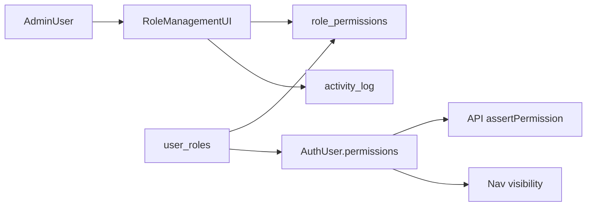

# RBAC Role & Permission Management — Review Pack

**Status:** DRAFT FOR REVIEW  
**Last updated:** 2026-07-02  
**Audience:** Leadership, ops leads, IT admins, product, engineering  
**Related:** [Current roles guide](../../business/roles-and-access.md) · [Prod RBAC setup](../../operations/prod-rbac-setup.md) · [Auth service](../../services/auth/overview.md)

---

## Purpose

This folder is a **review pack** for a planned upgrade to Zap's Role-Based Access Control (RBAC). It describes **what we want to build** — not what is live today.

**Today:** Roles and their permissions are seeded by database migrations. Admins can assign roles to users but **cannot add or remove individual permissions** on a role. Several sensitive actions (GRN audit, invoice collection, debit/credit decisions) are hard-coded to users with the `admin` **role name**, not to assignable permissions.

**Proposed:** Admins edit permissions per role in **Settings → Role Management**, using a **module-grouped, searchable** permission catalog. Former admin-only gates become **grantable permissions** (default still on `admin` and appropriate business roles). Changes are recorded in the **activity log**.

> **Current production behavior** remains documented in [roles-and-access.md](../../business/roles-and-access.md) and [prod-rbac-setup.md](../../operations/prod-rbac-setup.md).

---

## How RBAC will work (proposed)

1. **Permissions** are `(resource, action)` tuples stored in `permissions`.
2. **Roles** are named bundles of permissions in `role_permissions`.
3. **Users** get one or more roles via `user_roles`; effective permissions are the **union** of all assigned roles.
4. **API routes** call `assertPermission(user, resource, action)` (or wildcard `*:*` for full admin).
5. **Navigation** hides modules the user has no permissions for (recommended v1).
6. **Admins** change role permissions in the UI; each save writes to `activity_log` and `admin_audit_log`.

---

## Documents in this pack

| Doc | Title | Read if you are… |
|-----|-------|------------------|
| [01-business-roles-proposal.md](01-business-roles-proposal.md) | Business roles proposal | Ops lead, HR, compliance, non-technical stakeholder |
| [02-permission-catalog.md](02-permission-catalog.md) | Permission catalog & API mapping | IT admin configuring access, backend engineer |
| [03-role-management-ui.md](03-role-management-ui.md) | Role Management UI spec | Product, frontend, admin users |
| [04-technical-implementation.md](04-technical-implementation.md) | Technical implementation plan | Engineers implementing after sign-off |
| [05-review-checklist.md](05-review-checklist.md) | Review checklist & open questions | PM, module owners signing off |
| [06-testing-checklist.md](06-testing-checklist.md) | RBAC testing checklist (auto + manual) | QA, engineering |

---

## Confirmed decisions (from stakeholder review)

These items are **agreed** unless overridden in [05-review-checklist.md](05-review-checklist.md):

- Admins can **add and remove permissions per role** (not read-only).
- Permission editor uses **module-based grouping** with **search/select** UI.
- **Listings** use **fine-grained** permissions (read, write, create, delete, secondary, bulk, etc.) — not a single toggle.
- **Inventory Management** role includes:
  - Scan & Update (ADD/REMOVE)
  - Bin Outward
  - GRN inventory receipt (book into bins after accounts approval)
  - Create/delete bin locations (`bins:manage`)
  - Warehouses and Bin Changes pages
- **Finance** can **collect invoices** via assignable permission `grn:invoice_collect` (not admin role name only).
- Former **admin-only API gates** become **permissions attachable to any role** (defaults still grant `admin`).
- Role and permission changes are tracked in **activity logs**.
- Inventory and permission mutations elsewhere should continue existing **activity log** instrumentation.

---

## Current implementation gaps

| Gap | Location |
|-----|----------|
| Role permissions are **view-only** in UI | [settings/users/page.tsx](../../../src/app/(app)/settings/users/page.tsx) — `RolePermissionsPanel` |
| No API to **update** role permissions | Only `GET /api/admin/roles/{name}/permissions` exists |
| No permission **catalog** API with module metadata | Permissions scattered across migrations |
| Sidebar shows **all modules** to all users | [app-sidebar.tsx](../../../src/components/layout/app-sidebar.tsx) — only `adminOnly` / `superAdminOnly` filtered |
| Listings create/delete require `*:*` admin | [listings/route.ts](../../../src/app/api/listings/route.ts), [listings/sku/[sku_id]/route.ts](../../../src/app/api/listings/sku/[sku_id]/route.ts) |
| GRN audit / accounts / invoice collect check `roles.includes("admin")` | [inbound/grns/[grnId]/route.ts](../../../src/app/api/inbound/grns/[grnId]/route.ts) |
| Debit/credit decide checks `roles.includes("admin")` | [pending-debit-credit/notes/[noteId]/decision/route.ts](../../../src/app/api/inbound/pending-debit-credit/notes/[noteId]/decision/route.ts) |
| Mobile uses role name for accounts approval | [InboundGrnActions.tsx](../../../../mobile/src/features/inbound/InboundGrnActions.tsx) |

---

## Proposed business roles (summary)

| DB role name (proposed) | Business name | One-line scope |
|-------------------------|---------------|----------------|
| `inventory_management` | Inventory Management | Full warehouse & inventory ops + listings read |
| `finance` | Finance | Finance queues, invoice collection, audit history + listings read |
| `ops_management` | Operation Management | Outbound flow + inventory management + listings read |
| `qc` | QC | Listings read + inbound (scope TBD) |
| `admin` | Administrator | Full access; user management + role permission editing |

Detail: [01-business-roles-proposal.md](01-business-roles-proposal.md)

---

## Review process

1. Read docs 01–03 for business and UX alignment.
2. Engineering reviews doc 04 for feasibility and phasing.
3. Module owners complete [05-review-checklist.md](05-review-checklist.md).
4. After sign-off, implementation is tracked separately (migration `078_*`, new Settings page, API routes).

**Do not treat this pack as deployed behavior** until the checklist is approved and code is merged.

---

*Back to:* [Enhancements index](../roadmap.md) · [Documentation hub](../../README.md)
