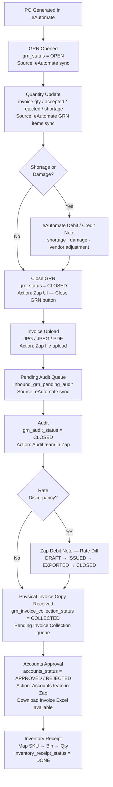
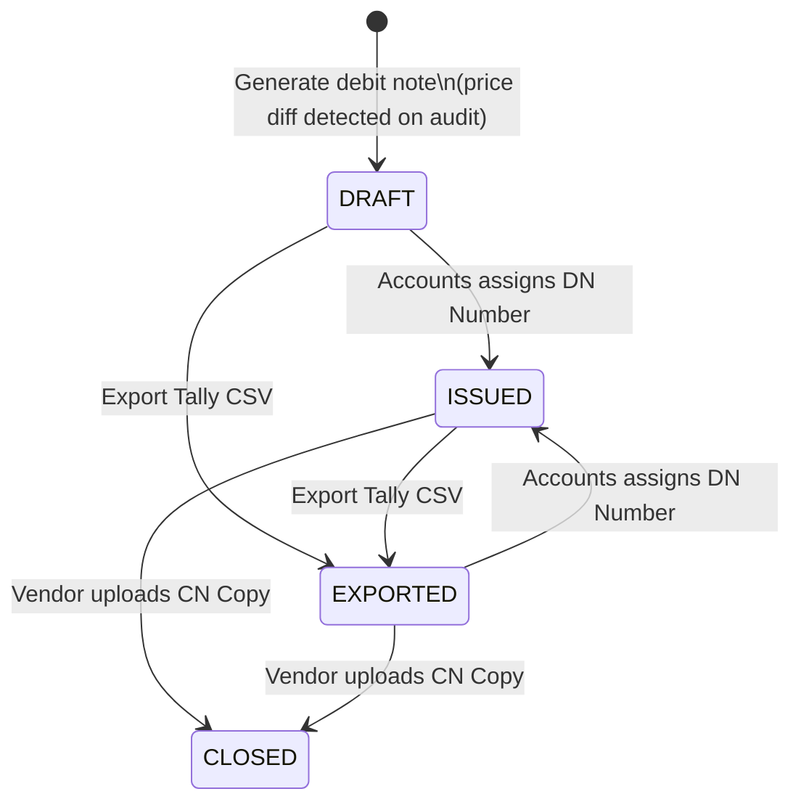
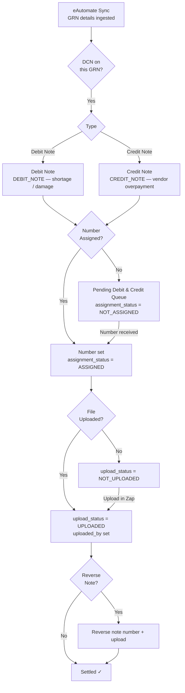

# Inbound GRN, Debit Note & Credit Note Flows

## 1 — GRN Lifecycle

---

## 2 — Zap Debit Note (Rate Discrepancy)

Created inside Zap when the audit price is lower than the vendor's received price.
Lives in `inbound_zap_debit_notes`.

**Status meanings**

| Status | Trigger |
|--------|---------|
| `DRAFT` | Auto-generated on "Generate debit note"; reference = `DN-GRN-{id}-{YYYYMMDD}` |
| `ISSUED` | Accounts team assigns a real DN number in the Zap UI |
| `EXPORTED` | Tally CSV downloaded via debit-note/export |
| `CLOSED` | Vendor CN copy uploaded via cn-copy endpoint |

---

## 3 — eAutomate Credit / Debit Note (Shortage · Damage)

Synced from eAutomate during GRN details ingest.
Lives in `inbound_grn_debit_credit_notes`.

**Key fields on `inbound_grn_debit_credit_notes`**

| Field | Purpose |
|-------|---------|
| `credit_debit_note_type` | `DEBIT_NOTE` or `CREDIT_NOTE` |
| `credit_debit_note_number` | Assigned by accounts / vendor |
| `credit_debit_note_number_assignment_status` | `ASSIGNED` / `NOT_ASSIGNED` |
| `credit_debit_note_upload_status` | `UPLOADED` / `NOT_UPLOADED` |
| `reverse_credit_debit_note_number` | Reverse note reference if applicable |

---

## Key Distinction

| | Zap Debit Note | eAutomate DCN |
|---|---|---|
| **Source** | Created in Zap | Synced from eAutomate |
| **Trigger** | Rate discrepancy found at audit | Shortage / damage reported by vendor |
| **Table** | `inbound_zap_debit_notes` | `inbound_grn_debit_credit_notes` |
| **Lifecycle** | DRAFT → ISSUED → EXPORTED → CLOSED | NOT_ASSIGNED → ASSIGNED → UPLOADED |
