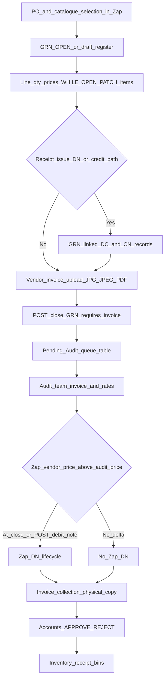
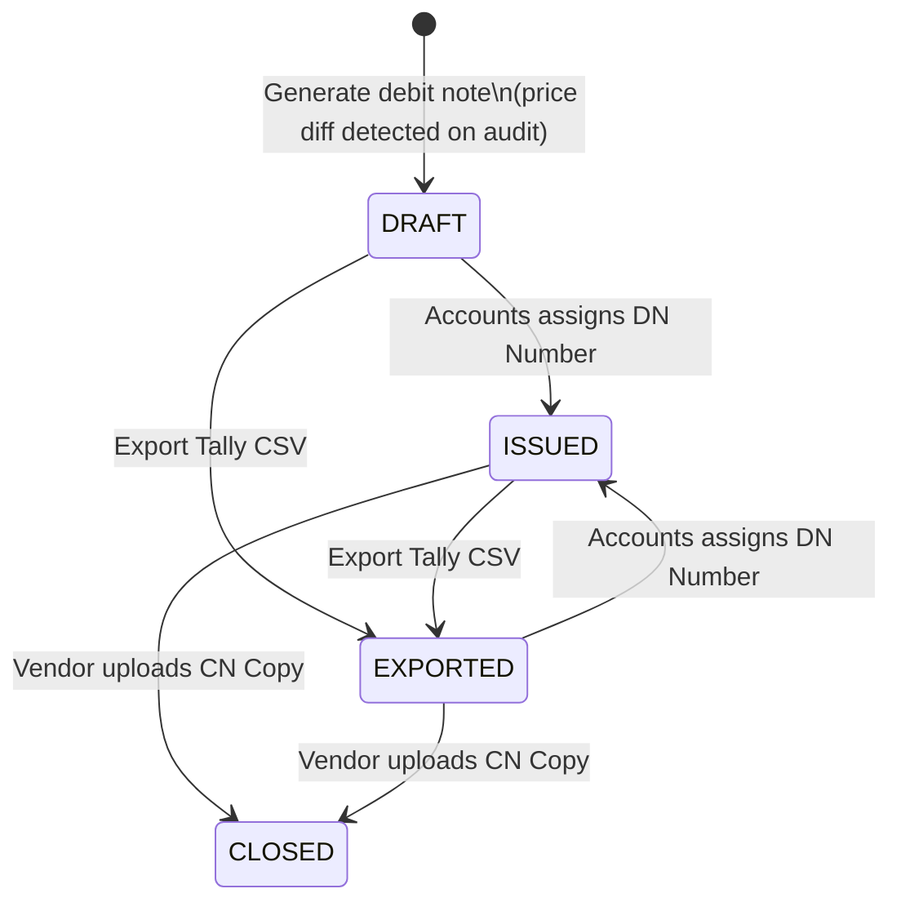
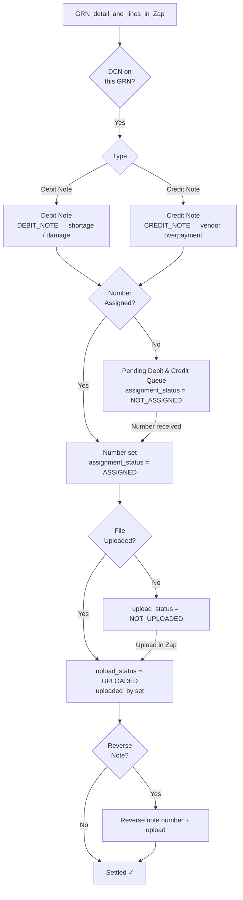

# Inbound GRN, Debit Note & Credit Note Flows

**System of record:** Zap (this app’s Postgres, APIs, and UI). Operational truth for inbound workflow—queues, statuses, uploads, approvals, debit/credit artefacts, and rate-diff debit notes—is **persisted and resolved in Zap**, not delegated to external ERP synchronisation.

## 1 — GRN Lifecycle (operator order)

Typical Zap sequence: **receive and edit lines while `OPEN` → attach vendor invoice → close GRN** (invoice required). **Pending Audit** surfaces GRNs from the Zap-maintained **`inbound_grn_pending_audit`** queue; the audit team verifies invoice alignment and enters **`audit_price`** on GRN lines. **Rate-diff Zap debit notes** are raised when discrepancies exist—see §2 for auto-on-close behaviour.

### Summary flow (stakeholder milestones)

Vendor selection → Item selection → **PO creation** → **GRN open** → **Receipt / quantity (and vendor price while OPEN)** → **Operational debit–credit handling** (when there is shortage, damage, or vendor-led adjustment—the **§3 GRN-linked** debit/credit records in Zap) → **GRN closed** → **Vendor invoice uploaded** (*see Zap ordering note*) → **Audit** (pending audit queue; **`audit_price`** on lines) → **Zap rate-diff debit note** (when **`received_price` > `audit_price`** — typically created on **`POST …/close`**, §2) → **Accounts** (approve/reject workflow) → **Physical invoice marked collected** (§1 Accounts — physical invoice) → **Assigned DN number** (when an **§2 Zap** DN exists — §2 “Accounts Team — Zap DN”) → **Invoice + DN Excel** (`GET …/invoice-export`) **Download**.

**Zap ordering:** In product, **`POST …/close` requires vendor invoice PDF already on file**; if your narrative lists *close → upload invoice*, reorder operations so **invoice upload precedes GRN close** in Zap.

**Physical copy vs Accounts:** In Zap, GRNs normally move **pending invoice collection** (physical copy **COLLECTED**) **before** the **accounts approval** outcome on that GRN; your own checklist may phrase “Accounts” broadly—match the Pending Invoice Collection hub and Pending Accounts queues in [`workflows.md`](./services/inbound/workflows.md).

The diagram below is the authoritative **technical** sequencing once PO / GRN exist **in Zap**.

### Invoice Audit Team

1. **Where they work:** The **Pending Audit** hub at route `/inbound/pending-audits` lists GRNs joined from **`inbound_grn_pending_audit`** with filters in `listPendingAuditGrnsPaginated` ([`inboundGrnsService.ts`](../../src/server/services/inboundGrnsService.ts)). That queue row set is Zap data (see service comments for lifecycle).
2. **What they verify:** Invoice vs receipt; **audit price** (`audit_price` and related keys on each GRN line `raw`) is captured via `PATCH …/items/{lineIndex}` on inbound GRNs ([`updateInboundGrnItemRaw`](../../src/server/services/inboundGrnsService.ts)).
3. **Rate discrepancy DN:** Zap compares **received (vendor) price** vs **audit price** when building lines for `inbound_zap_debit_notes` ([`generateDebitNote`](../../src/server/services/grnDebitNoteService.ts)). This is distinct from receipt-issue debit/credit records in §3.

### Accounts Team — Physical invoice copy

Business wording **Pending Physical Copy Receiving** maps to Zap’s **Pending Invoice Collection** queue (`/inbound/pending-invoice-collection`), backed by **`inbound_grn_pending_invoice_collection`** together with **`inbound_grns`** lifecycle fields—maintained **in Zap** like other inbound queues.

1. **Mark received:** The Accounts team selects rows (bulk or per row) and sets **`grn_invoice_collection_status` to `COLLECTED`** via **`PATCH /api/inbound/grns/{grnId}`** ([`pending-invoice-collection/page.tsx`](../../src/app/%28app%29/%28logistics%29/inbound/pending-invoice-collection/page.tsx)). That completes “physical copy received” in Zap; marking does **not** by itself emit a stored file.

2. **Invoice Excel:** After **`COLLECTED`**, operators download a workbook **on demand** — **Download Invoice Excel** on the GRN **Accounts** tab, or **`GET /api/inbound/grns/{grnId}/invoice-export`** ([`buildInvoiceExcel`](../../src/server/services/grnDebitNoteService.ts)). The export is operator-initiated, not triggered automatically when collection is marked.

---

## 2 — Zap Debit Note (Rate Discrepancy)

**Creation:** Zap writes a row to `inbound_zap_debit_notes` **automatically immediately after a successful `POST …/close`** when at least one line has positive accepted quantity and `received_price > audit_price` (same eligibility as explicit generation, with `force_regenerate: false` on the automatic path). No discrepancy → close still succeeds with no DN. If a **terminal** Zap note already exists (`ISSUED` / `CLOSED`), auto-generation is skipped without failing close (HTTP **409** from `generateDebitNote` is swallowed). Operators may also call **`POST /api/inbound/grns/[grnId]/debit-note`** to generate or regenerate subject to status and optional `force_regenerate`.

Lives in `inbound_zap_debit_notes`.

**Status meanings**

| Status | Trigger |
|--------|---------|
| `DRAFT` | Auto-created on **`POST …/close`** when rate discrepancy lines exist; or via **`POST …/debit-note`**; reference pattern `DN-GRN-{id}-{YYYYMMDD}` |
| `ISSUED` | Accounts team assigns a real DN number in the Zap UI |
| `EXPORTED` | Tally CSV downloaded via debit-note/export |
| `CLOSED` | Vendor CN copy uploaded via cn-copy endpoint |

### Accounts Team — Zap DN (if applicable)

This is the **rate-discrepancy** Zap debit note only—not the shortage/damage GRN-linked records in §3.

1. **When it applies:** A row exists in `inbound_zap_debit_notes` when there is a positive price delta (`received_price > audit_price`) on accepted quantity—typically after **`POST …/close`** (auto) or **`POST …/debit-note`** (explicit). If **no** Zap note exists, Accounts has no Zap DN number to assign; the invoice Excel export still works but omits DN summary lines and the **Debit Note** worksheet.

2. **Assign DN number:** Accounts sets the real vendor/register **DN number** with **`PATCH /api/inbound/grns/[grnId]/debit-note`** and JSON body `{ "dn_number": "<assigned number>" }`, which calls [`assignDnNumber`](../../src/server/services/grnDebitNoteService.ts) and moves **`DRAFT` / `EXPORTED`** → **`ISSUED`**.

3. **Invoice and DN in Excel:** **`GET /api/inbound/grns/[grnId]/invoice-export`** ([`buildInvoiceExcel`](../../src/server/services/grnDebitNoteService.ts)) builds one workbook: **Summary** (includes DN reference, number, total, status when a note exists), **GRN Items**, and **Debit Note** line sheet when applicable. On the web GRN **Accounts** tab, **Download Invoice Excel** appears after physical invoice **`COLLECTED`** (see §1); the API route itself does not enforce `COLLECTED`.

4. **Close the demand (CN copy):** After the DN is raised and numbered, **`POST /api/inbound/grns/[grnId]/debit-note/cn-copy`** (multipart `file`) stores the vendor **CN copy** and sets the note to **`CLOSED`** ([`uploadCnCopy`](../../src/server/services/grnDebitNoteService.ts)); a DN number must already be assigned.

5. **Alternate close (no CN file):** **`PATCH …/debit-note`** with `{ "close": true }` calls [`closeDnDemand`](../../src/server/services/grnDebitNoteService.ts) and sets **`CLOSED`** without an uploaded CN—use only when your process allows closing the demand without storing a CN PDF in Zap.

---

## 3 — GRN-linked credit / debit note (shortage · damage · vendor adjustment)

Zap persists these on **`inbound_grn_debit_credit_notes`**; numbering, uploads, pending queues, and decisions are enforced through **this product** (source of truth in Zap Postgres).

**Key fields on `inbound_grn_debit_credit_notes`**

| Field | Purpose |
|-------|---------|
| `credit_debit_note_type` | `DEBIT_NOTE` or `CREDIT_NOTE` |
| `credit_debit_note_number` | Assigned by accounts / vendor |
| `credit_debit_note_number_assignment_status` | `ASSIGNED` / `NOT_ASSIGNED` |
| `credit_debit_note_upload_status` | `UPLOADED` / `NOT_UPLOADED` |
| `reverse_credit_debit_note_number` | Reverse note reference if applicable |

---

## Key distinction

| | Zap rate-diff debit note (§2) | GRN-linked debit/credit records (§3) |
|---|---|---|
| **Source** | Created in Zap from rate audit deltas | Persisted on the GRN in Zap |
| **Trigger** | **`received_price` > `audit_price`** after audit-aware close / generate | Receipt issues, vendor shortage/damage/overpayment workflows |
| **Table** | `inbound_zap_debit_notes` | `inbound_grn_debit_credit_notes` |
| **Lifecycle** | DRAFT → ISSUED → EXPORTED → CLOSED | Assignment / upload / reversal per fields on §3 diagram |
