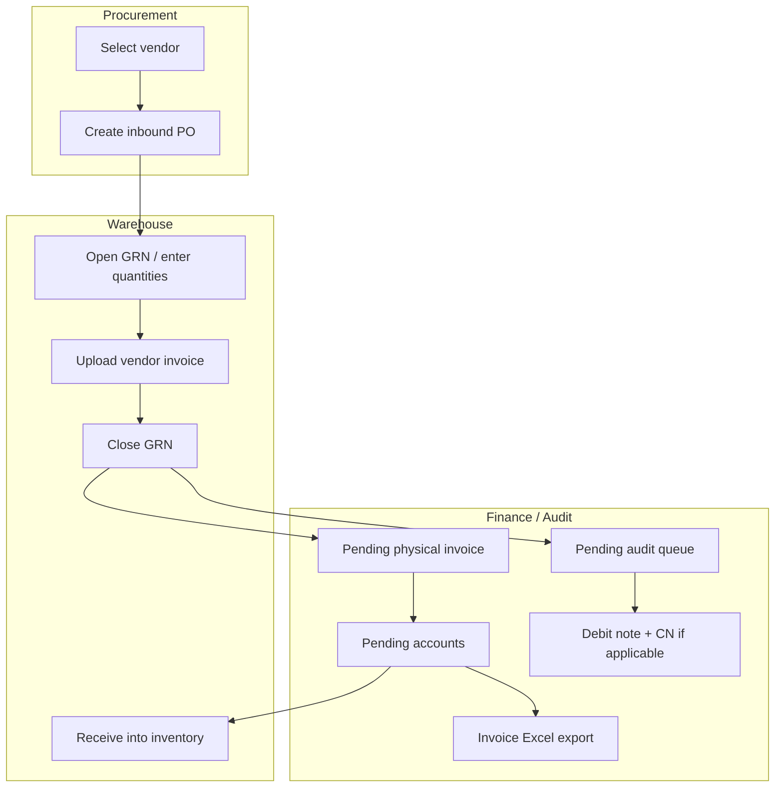

# Inbound journey

**Audience:** Operations, warehouse, finance, procurement, engineers  
**System of record:** Zap PostgreSQL + web UI (`/inbound/*`). Historical eAutomate data may be synced in; day-to-day work runs in Zap.

> **Canonical hub** for the goods-in flow. Operator checklists, API matrices, and state diagrams are linked below — not duplicated here.

---

## Summary

Inbound covers everything that enters the warehouse from **vendors**: raise or sync a **purchase order (PO)**, receive goods in a **GRN (Goods Receipt Note)**, upload the vendor **invoice**, pass **audit** and **accounts** queues, handle **debit/credit notes** when needed, and **book stock into bins** when approved.

---

## Journey diagram



**Zap execution order (critical):** upload vendor invoice **before** `POST …/close` — close fails without at least one invoice file on the GRN.

---

## Step-by-step (web + API)

| Step | Team | Web (primary) | Key API / action | Deep dive |
|------|------|---------------|------------------|-----------|
| 1. Vendor directory | Procurement | `/inbound`, `/inbound/vendors/[id]` | Vendor + listing routes | [Process notes §I](services/inbound/inbound-tab-process-notes.md) |
| 2. Raise inbound PO | Procurement | Vendor PO pages, `/inbound/purchase-orders` | Inbound PO create / list APIs | [Process notes §II](services/inbound/inbound-tab-process-notes.md) |
| 3. Open GRN | Warehouse | `/inbound/grns`, GRN detail | `GET …/details`, `POST …/register-operational` | [GRN flows](inbound-grn-debit-credit-note-flows.md) |
| 4. Edit receipt lines | Warehouse | GRN detail (OPEN) | `PATCH …/items/[lineIndex]` | [API test matrix](inbound-journey-api-test-matrix.md) |
| 5. Upload vendor invoice | Warehouse | GRN Documents / close flow | `POST …/upload-zap` | [Process notes §IV](services/inbound/inbound-tab-process-notes.md) |
| 6. Close GRN | Warehouse | GRN detail | `POST …/close` (+ optional rate-diff DN draft) | [workflows.md](services/inbound/workflows.md) |
| 7. Pending audit | Audit | `/inbound/pending-audits` | `GET` queue + `PATCH` GRN audit fields | [Process notes §V](services/inbound/inbound-tab-process-notes.md) |
| 8. Physical invoice copy | Accounts | `/inbound/pending-invoice-collection` | `PATCH` → `COLLECTED` on collection status | [Process notes §VI](services/inbound/inbound-tab-process-notes.md) |
| 9. Accounts approval | Accounts | `/inbound/pending-accounts` | `PATCH /api/inbound/grns/[grnId]` | [workflows.md](services/inbound/workflows.md) |
| 10. Debit / credit notes | Finance | GRN detail, `/inbound/pending-debit-credit` | `debit-note`, `cn-copy`, eAutomate DCN queue | [GRN flows §2–3](inbound-grn-debit-credit-note-flows.md) |
| 11. Invoice Excel | Accounts | GRN Accounts tab | `GET …/invoice-export` (after **COLLECTED** on web) | [API test matrix](inbound-journey-api-test-matrix.md) |
| 12. Book inventory | Warehouse | GRN detail (after APPROVED) | `POST …/receive-inventory` | [API test matrix](inbound-journey-api-test-matrix.md) |

---

## Who does what

| Team | Responsibility |
|------|----------------|
| **Procurement** | Vendors, inbound POs (create or monitor sync) |
| **Warehouse** | GRN quantities, invoice upload, GRN close, receive into bins |
| **Audit** | Verify invoice vs receipt; capture `audit_price` on lines |
| **Accounts** | Physical invoice collection, approval, DN numbering, Excel export |
| **Operations** | Queue hygiene, escalations, sync runs when data is stale |

---

## Debit note types (short)

| Type | When | Where documented |
|------|------|------------------|
| **Rate-diff Zap DN** | `received_price` > `audit_price` at/after close | [inbound-grn-debit-credit-note-flows.md](inbound-grn-debit-credit-note-flows.md) §2 |
| **Receipt-issue / DCN** | Shortage, damage, vendor CN workflows | Same doc §3; pending debit/credit hub |

---

## Tests and fixtures

Automated coverage map: [inbound-journey-api-test-matrix.md](inbound-journey-api-test-matrix.md).

```bash
cd web
psql "$TEST_DATABASE_URL" -v ON_ERROR_STOP=1 -f tests/fixtures/inbound_journey_fixture.sql
npx tsx --test tests/api/inbound-journey-integration.test.mjs
```

---

## Related documentation

| Topic | Document |
|-------|----------|
| Operator checklist | [services/inbound/inbound-tab-process-notes.md](services/inbound/inbound-tab-process-notes.md) |
| Statuses, Zap DN vs DCN | [inbound-grn-debit-credit-note-flows.md](inbound-grn-debit-credit-note-flows.md) |
| API routes + test matrix | [inbound-journey-api-test-matrix.md](inbound-journey-api-test-matrix.md) |
| Service workflows | [services/inbound/workflows.md](services/inbound/workflows.md) |
| API index | [services/inbound/api.md](services/inbound/api.md) |
| Business overview | [business/modules/inbound.md](business/modules/inbound.md) |
| End-to-end narrative | [business/workflows/end-to-end-flows.md](business/workflows/end-to-end-flows.md) (Workflow 1) |
| Mobile parity | [mobile/inbound-grn-flow-parity.md](mobile/inbound-grn-flow-parity.md) |
| Documentation index | [README.md](README.md) |
