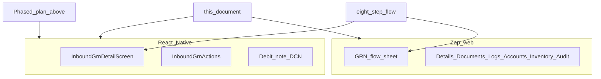

# Inbound GRN flow — web vs mobile parity

Single reference for aligning the **Zap web** GRN experience (see “How this GRN flow works” on `/inbound/grns/[grnId]`) with the **React Native** client: canonical sequence, current code mapping, a **phased mobile update plan** (detailed rollout), gaps, and DB notes for Zap-owned logs.

---

## Purpose

- Keep **one canonical business order** (eight steps) across web and mobile.
- Track **which screens and APIs** implement each step on each platform.
- Use the **phased plan** below as the working backlog for mobile engineering (order can be reprioritized by product).

Deeper inbound mechanics and bundle shape: [services/inbound/workflows.md](../services/inbound/workflows.md). Debit/credit note flows: [inbound-grn-debit-credit-note-flows.md](../inbound-grn-debit-credit-note-flows.md). High-level module narrative: [business/modules/inbound.md](../business/modules/inbound.md).

### Mobile implementation status (code)

| Phase | Status | Notes |
|-------|--------|--------|
| 1 — Data alignment | Done | [`grnDetailBundle.ts`](../../../mobile/src/features/inbound/grnDetailBundle.ts) + [`InboundGrnDetailScreen.tsx`](../../../mobile/src/features/inbound/InboundGrnDetailScreen.tsx) use merged `header` / `grn_items` / `invoice_files` / `grn_logs`; DCN fallbacks; flow hints. |
| 2 — Invoice upload | Done | [`uploadVendorInvoiceFile`](../../../mobile/src/features/inbound/inbound.repository.ts) + Documents tab; max 2 files; `pick` helper for typings. |
| 3 — Register operational GRN | Done | [`registerOperationalGrn`](../../../mobile/src/features/inbound/inbound.repository.ts) + card when `grn_id < 0`; `navigation.replace` to new id. |
| 4 — Line PATCH | Done | Modal editor per line when `OPEN`; [`patchGrnLine`](../../../mobile/src/features/inbound/inbound.repository.ts). |
| 5 — Logs tab | Done | **`logs`** tab lists bundle `grn_logs`. Accounts/inventory: still [`InboundGrnActions`](../../../mobile/src/features/inbound/InboundGrnActions.tsx) on Summary (no separate queue links yet). |
| 6 — In-app help | Backlog | Optional modal; web parity doc remains source of truth. |

**Tests:** [`mobile/__tests__/grnDetailBundle.test.ts`](../../../mobile/__tests__/grnDetailBundle.test.ts), [`mobile/__tests__/inbound.repository.test.ts`](../../../mobile/__tests__/inbound.repository.test.ts).

---

## Reference — Canonical eight-step flow

| Step | Business step | Zap web surface (typical) | API / behavior (summary) |
|------|---------------|---------------------------|---------------------------|
| 1 | Know draft vs operational GRN id | Header badges, draft register card | Negative `grn_id` → draft; positive → operational receipt |
| 2 | Register operational id (drafts) | “Register operational GRN number” card | Register replaces draft id with positive id; status → OPEN where applicable |
| 3 | Record receipt while OPEN | GRN Details tab, line table, GRN Section sheet | `PATCH .../items/{lineIndex}`; editable until closed |
| 4 | Attach vendor invoice (JPG/JPEG/PDF, max 2 × 4MB) | GRN Documents tab **or** **Close GRN** dialog | `POST .../upload-zap` with `kind=invoice` |
| 5 | Close GRN | Header **Close GRN** (only when `OPEN`); modal review | `POST .../close`; requires invoice on file. Server **auto-creates** a Zap rate-diff debit note (`DRAFT`) when any line has `received_price > audit_price`; see [inbound-grn-debit-credit-note-flows.md](../inbound-grn-debit-credit-note-flows.md) §2. |
| 6 | Accounts (if used) | Accounts tab | `PATCH` / accounts flows per product rules. **Invoice Excel** (`GET …/invoice-export`) is **web-only** today: available after **`grn_invoice_collection_status === 'COLLECTED'`**, **operator-initiated** download — not auto-generated on mobile or by the mark-collected `PATCH`. |
| 7 | Inventory to bins | Inventory receipt tab | Receive-inventory APIs; bins must exist for SKU |
| 8 | Audit and debit note | Audit & Debit Note tab | Pending Audit queue verifies invoice and line **audit prices**. Zap DN: **`PATCH …/debit-note`** with **`dn_number`**, **`POST …/debit-note/cn-copy`** to **`CLOSED`**, Tally `…/export`; combined invoice + DN rows live in **`GET …/invoice-export`** (web); parity with web `POST …/debit-note` for manual regenerate. |

Web register route: `POST /api/inbound/grns/{draftId}/register-operational` with `operational_grn_id` ([`register-operational/route.ts`](../../src/app/api/inbound/grns/[grnId]/register-operational/route.ts)).

---

## Current mobile inventory (baseline)

Repo: `mobile/src/features/inbound/`.

| Area | Files | Notes |
|------|--------|--------|
| GRN detail shell | [`InboundGrnDetailScreen.tsx`](../../../mobile/src/features/inbound/InboundGrnDetailScreen.tsx) | Tabs: `summary` \| `items` \| `documents` \| `debit_note`. |
| Actions | [`InboundGrnActions.tsx`](../../../mobile/src/features/inbound/InboundGrnActions.tsx) | `closeGrn`, `updateGrnStatus`; close when `grn_status === 'OPEN'`; post-close audit / invoice collection / accounts. |
| DCN / debit note UI | [`InboundGrnDcnSection.tsx`](../../../mobile/src/features/inbound/InboundGrnDcnSection.tsx), [`InboundGrnDebitNoteTab.tsx`](../../../mobile/src/features/inbound/InboundGrnDebitNoteTab.tsx) | DCN assign/upload; debit note tab. |
| API layer | [`inbound.repository.ts`](../../../mobile/src/features/inbound/inbound.repository.ts) | No `uploadVendorInvoice` / `kind=invoice` helper yet; `uploadDcnFile` uses `upload-zap` with `kind=debit_note`. |

**Bundle shape vs UI:** The details API returns a **bundle** (`header`, `snapshot`, `invoice_files`, `grn_items`, `grn_logs`, `added_items`, `debit_credit_notes`) per [workflows.md](../services/inbound/workflows.md). The mobile screen currently reads flat keys such as `data.items` and `data.files` in tabs. Align with either a **normalization layer** after `fetchGrnDetail` (recommended) or by switching tab code to `data.grn_items` / `data.invoice_files` / merged `header` fields so status badges and lists match web data.

---

## Phased mobile update plan (detailed)

Use this as the default sequencing; merge or split phases per sprint capacity. Each phase lists **goal**, **deliverables**, **primary files**, **APIs**, **acceptance criteria**, and **depends on**.

### Phase 1 — Data model alignment & operator clarity

**Goal:** Mobile GRN detail reflects the same server bundle as web; users understand why actions (e.g. Close) are missing.

| Item | Detail |
|------|--------|
| **Deliverables** | (1) Central **view-model** (hook or mapper): merge `header` onto a typed shape for screens; expose `grn_items`, `invoice_files`, `grn_logs`, `header.grn_status`, etc. (2) **Documents** tab lists `invoice_files` (download links via existing API patterns or `download_url`). (3) **Items** tab lists `grn_items` with the same line fields teams need for read-first workflows. (4) **Summary** status row reads from `header` so badges match web. (5) Copy or banner: when `header.grn_status !== 'OPEN'`, short hint aligned with web (closed → use Documents; draft → register operational GRN first). |
| **Primary files** | `InboundGrnDetailScreen.tsx`; new e.g. `useGrnDetailModel.ts` or `grnDetailBundle.ts` next to feature; optional small tests under `mobile/__tests__/`. |
| **APIs** | Existing `GET inbound/grns/{id}/details` (no change). |
| **Acceptance** | QA compares same GRN on web and mobile: statuses, line count, invoice file count match. No `undefined` statuses caused by wrong key paths. |
| **Depends on** | None. |

---

### Phase 2 — Vendor invoice upload (step 4 parity)

**Goal:** Field users can attach vendor invoices on mobile under the same rules as web (JPG/JPEG/PDF, max 2 files, 4MB each).

| Item | Detail |
|------|--------|
| **Deliverables** | (1) `uploadVendorInvoiceFiles` (or generic `postUploadZap`) in `inbound.repository.ts`: `POST inbound/grns/{id}/upload-zap`, `kind=invoice`, same validation errors as [upload-zap route](../../src/app/api/inbound/grns/[grnId]/upload-zap/route.ts). (2) **Documents** tab: file picker (reuse `DocumentPicker` pattern from DCN), progress/error toasts, invalidate `['inbound','grn', grnId]`. (3) Optional banner when OPEN and zero invoice files: “Add invoice before close.” |
| **Primary files** | `inbound.repository.ts`, `InboundGrnDetailScreen.tsx` (Documents tab), shared validation helper if needed. |
| **APIs** | `POST .../upload-zap` (`multipart/form-data`, `kind=invoice`). Requires Zap Storage env (same as web). |
| **Acceptance** | Upload succeeds; detail refresh shows new row in invoice list; oversize/wrong extension rejected with clear message. |
| **Depends on** | Phase 1 (correct `invoice_files` display). |

---

### Phase 3 — Register operational GRN (step 2 parity)

**Goal:** Users opening a **draft** GRN (`grn_id < 0` / `DRAFT_ZAP`) can register the real warehouse GRN id without switching to web.

| Item | Detail |
|------|--------|
| **Deliverables** | (1) Repository: `registerOperationalGrn(api, draftGrnId, operationalGrnId)` → `POST inbound/grns/{draftId}/register-operational` with JSON body `{ operational_grn_id }`. (2) UI: form on Summary or dedicated banner when `grn_id < 0` (numeric input + submit + loading/error). (3) On success: navigation must switch to the **new** GRN id (stack reset or `navigation.replace` / query key update) per server response / redirect semantics used on web. (4) Invalidate list queries that keyed on old id. |
| **Primary files** | `inbound.repository.ts`, `InboundGrnDetailScreen.tsx` or `InboundGrnDraftRegisterCard.tsx`; navigation types in `InboundStackParamList`. |
| **APIs** | `POST .../register-operational`. |
| **Acceptance** | After register, user lands on operational GRN detail; PO/vendor linkage preserved; no duplicate draft stuck in nav stack. |
| **Depends on** | Phase 1 (correct header/draft detection). |

---

### Phase 4 — Line editing parity (step 3)

**Goal:** Reduce forced context-switch to web for quantity/price updates while OPEN.

| Item | Detail |
|------|--------|
| **Deliverables** | (1) For each line in `grn_items`, expose editable fields that map to web’s `PATCH inbound/grns/{grnId}/items/{lineIndex}` body (same validation as web `buildGrnLinePatchBody` / server rules). (2) UX: per-line sheet or inline numeric fields; disabled when `grn_status !== 'OPEN'`. (3) Optimistic or refresh-after-success; handle permission errors. |
| **Primary files** | New component e.g. `InboundGrnLineEditor.tsx`; `InboundGrnDetailScreen.tsx` Items tab; `inbound.repository.ts` (`patchGrnLine`). |
| **APIs** | `PATCH .../items/{lineIndex}`. |
| **Acceptance** | PATCH reflected in refreshed bundle; totals on Summary consistent with web after edit. |
| **Depends on** | Phase 1. |

**Alternative (lighter sprint):** Deep link to Zap web GRN URL for editing only; keep Phase 4 full implementation in backlog.

---

### Phase 5 — Logs, accounts, inventory surfacing

**Goal:** Operators can complete downstream steps without guessing where those states live.

| Item | Detail |
|------|--------|
| **Deliverables** | (1) **Logs:** new tab or “Activity” section listing `grn_logs` (newest first), read-only; optional pull-to-refresh. (2) **Accounts / inventory:** either embed actions already partially in `InboundGrnActions` with clearer grouping, or link out to existing mobile queues (`InboundPendingAccountsScreen`, etc.) with GRN id query param if stack supports it. (3) Match web labels for `accounts_status`, `inventory_receipt_status` where applicable. |
| **Primary files** | `InboundGrnDetailScreen.tsx`, new `InboundGrnLogsTab.tsx` or list section; navigation entries under `mobile/src/app/navigation/` as needed. |
| **APIs** | Data already in details bundle (`grn_logs`); accounts/inventory may reuse existing PATCH routes from web parity review. |
| **Acceptance** | Log lines visible for actions taken on web or mobile; accounts/inventory path documented for QA. |
| **Depends on** | Phase 1. Can partially parallelize with Phase 2–4. |

---

### Phase 6 — In-app “How this flow works” & polish

**Goal:** Same mental model as web’s sheet (`web/.../page.tsx` workflow sheet).

| Item | Detail |
|------|--------|
| **Deliverables** | (1) Modal or screen with eight-step copy (short form) + link to this doc for engineers. (2) Entry point: overflow menu or help icon on GRN detail. (3) Copy updates when web sheet changes (review quarterly). |
| **Primary files** | New `InboundGrnFlowHelpModal.tsx` (or similar); wire from `InboundGrnDetailScreen`. |
| **APIs** | None. |
| **Acceptance** | Product/QA sign-off on wording; works offline (static copy). |
| **Depends on** | Optional; best after Phases 1–2 so screenshots match reality. |

---

### Cross-cutting backlog (non-sequential)

| Item | Notes |
|------|--------|
| Close GRN before invoice on mobile | Web enforces invoice on file; mobile `closeGrn` only — ensure API errors surface if business rule violated; align UX with web toast. |
| Debit note / CN / Tally | Largely covered by existing tabs; re-test after Phase 1 bundle fix. |
| Performance | Large `grn_items` lists: FlatList windowing, avoid re-fetch storms on tab switch. |

---

## Residual gaps tracker (ticket-sized)

Use when an item does not fit a single phase above.

- **Vendor invoice upload** — Implemented on mobile (Documents tab); server rules unchanged.
- **Operational GRN registration** — Implemented (draft path + `navigation.replace`).
- **GRN Logs tab** — Implemented; server may require migration **056** for new log rows.
- **Line editing parity** — Implemented (modal); edge validation still server-side.
- **Accounts / inventory** — Phase 5 + confirm ops model with stakeholders.

---

## Phase D — DB / ops (Zap-owned GRN logs)

Application code uses `nextval('inbound_grn_logs_log_id_seq')` when appending logs.

- Migration: [`056_inbound_grn_logs_log_id_seq.sql`](../../migrations/056_inbound_grn_logs_log_id_seq.sql).
- Migrate script: [`run_migrations.sh`](../../scripts/run_migrations.sh).
- Service: [`inboundGrnLogService.ts`](../../src/server/services/inboundGrnLogService.ts).

If the sequence is missing on an environment, log inserts fail (errors may be swallowed by `appendInboundGrnLogSafe` while the main API still returns success). **Apply 056** on every environment that runs the web API.

---

## Relationship diagram

