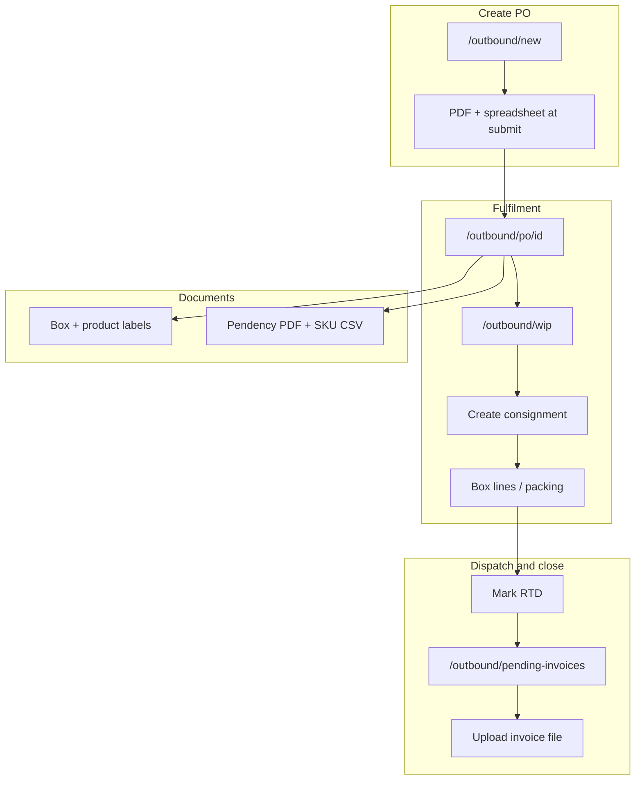

# Outbound journey

**Audience:** Operations, warehouse, channel management, accounts, engineers  
**System of record:** Zap PostgreSQL + web UI (`/outbound/*`). Channel POs may originate from eAutomate sync; fulfilment, labels, and reports run in Zap.

> **Canonical hub** for the channel fulfilment flow. Process notes, pendency PDF rules, and API references are linked below.

---

## Summary

Outbound covers **channel purchase orders** (Blinkit, Swiggy, etc.): create or sync a PO, load **line items**, work **WIP** POs, build **consignments** and **box lines**, mark **RTD**, handle **pending invoices**, print **labels**, and download **SKU / pendency reports**.

---

## Journey diagram



**Zap at create:** `POST /api/outbound/purchase-orders` requires **one PDF** and **one spreadsheet/CSV** (2MB each) in the same submission.

---

## Step-by-step (web + API)

| Step | Team | Web route | Key API / action | Deep dive |
|------|------|-----------|------------------|-----------|
| 1. Create PO | Ops | `/outbound/new` | `POST /api/outbound/purchase-orders` (PDF + spreadsheet) | [Process notes §I–II](services/outbound/outbound-tab-process-notes.md) |
| 2. Line items | Ops | `/outbound/po/[id]` | `POST …/attachments` → spreadsheet parse | [Process notes §III](services/outbound/outbound-tab-process-notes.md) |
| 3. List / filter POs | Ops | `/outbound`, `/outbound/wip`, `/outbound/partial` | `GET /api/outbound/purchase-orders` | [workflows.md](services/outbound/workflows.md) |
| 4. Acknowledge / cancel | Ops | PO detail actions | `POST …/eautomate-actions` (`acknowledge`, `cancel`) | [api.md](services/outbound/api.md) |
| 5. EAN / master SKU | Ops | `/outbound/ean-mappings` | `GET /api/ean-mappings/matrix` | Supports pendency + line-item display |
| 6. Consignment | Ops / WH | PO detail → consignments | `POST …/consignments` | [Process notes §V](services/outbound/outbound-tab-process-notes.md) |
| 7. Packing / boxes | Warehouse | PO detail, `/outbound/boxes` | `POST …/consignments/[id]/boxes` | [Process notes §VI](services/outbound/outbound-tab-process-notes.md) |
| 8. RTD | Logistics | `/outbound/consignments/[id]` | Consignment status / transport fields | [Process notes §VII](services/outbound/outbound-tab-process-notes.md) |
| 9. Pending invoices | Accounts | `/outbound/pending-invoices` | Invoice number + `POST …/invoice-upload` | [Process notes §VIII](services/outbound/outbound-tab-process-notes.md) |
| 10. Reports | Ops | PO detail actions | `download_pendency_pdf`, `download_sku_report` | [pendency-pdf.md](services/outbound/pendency-pdf.md) |
| 11. Labels | Ops / WH | PO detail, `/labels` | `generate_phase1_box_labels`, `POST /api/labels/generate` | [Process notes §IX](services/outbound/outbound-tab-process-notes.md) |

New Zap PO rows default **`is_wip = YES`**. Synced POs with **`is_wip = NO`** may need upstream WIP resolution before consignment creation.

---

## Pendency PDF (snapshot)

Downloaded via **`download_pendency_pdf`** → `pendency-{po_number}.pdf`.

| PDF column | Source |
|------------|--------|
| **PO SKU** | `po_secondary_sku` (channel item code, e.g. `10149918`) |
| **Company Code Primary** | Product **`master_sku`** (e.g. `AAC500`) from line / `listings` / **`company_ean_mappings.sku_code`** via PO SKU — **not** EAN barcode, **not** a repeat of PO SKU |
| **Warehouse Inventory** | Sum of Zap **`bins.available_quantity`** for resolved SKU keys |
| **M.R.P** | Line `mrp` |
| **Pending** | `pending` or `demand - packed - dispatched` |

Full resolution order and examples: [services/outbound/pendency-pdf.md](services/outbound/pendency-pdf.md).  
Implementation: [`outboundPoPendencyPdf.ts`](../src/server/utils/outboundPoPendencyPdf.ts).

---

## SKU Level Report (CSV)

**`download_sku_report`** — commercial columns, **Master SKU**, **GST %** (from line data or computed from rates). See [`eautomate-actions/route.ts`](../src/app/api/outbound/purchase-orders/[id]/eautomate-actions/route.ts) and [`outboundPurchaseOrdersService.ts`](../src/server/services/outboundPurchaseOrdersService.ts).

---

## Who does what

| Team | Responsibility |
|------|----------------|
| **Channel / key accounts** | Monitor PO intake, acknowledgement |
| **Operations** | PO create, WIP, consignments, reports, labels |
| **Warehouse** | Pick, pack, box lines, apply labels |
| **Logistics** | RTD, dispatch metadata |
| **Accounts** | Invoice number, pending invoice upload |

---

## Tests

```bash
cd web && npx tsx --test tests/unit/outbound-po-pendency-pdf.test.ts
```

There is no outbound journey integration matrix yet (unlike inbound). Unit tests cover pendency row resolution.

---

## Related documentation

| Topic | Document |
|-------|----------|
| Operator checklist | [services/outbound/outbound-tab-process-notes.md](services/outbound/outbound-tab-process-notes.md) |
| Pendency PDF columns | [services/outbound/pendency-pdf.md](services/outbound/pendency-pdf.md) |
| Service workflows | [services/outbound/workflows.md](services/outbound/workflows.md) |
| API index | [services/outbound/api.md](services/outbound/api.md) |
| Business overview | [business/modules/outbound.md](business/modules/outbound.md) |
| End-to-end narrative | [business/workflows/end-to-end-flows.md](business/workflows/end-to-end-flows.md) (Workflow 2) |
| Mobile screens | [mobile/outbound-screens.md](mobile/outbound-screens.md) |
| Consignments sync plan | [outbound-consignments-data-sync-plan.md](outbound-consignments-data-sync-plan.md) |
| Documentation index | [README.md](README.md) |
