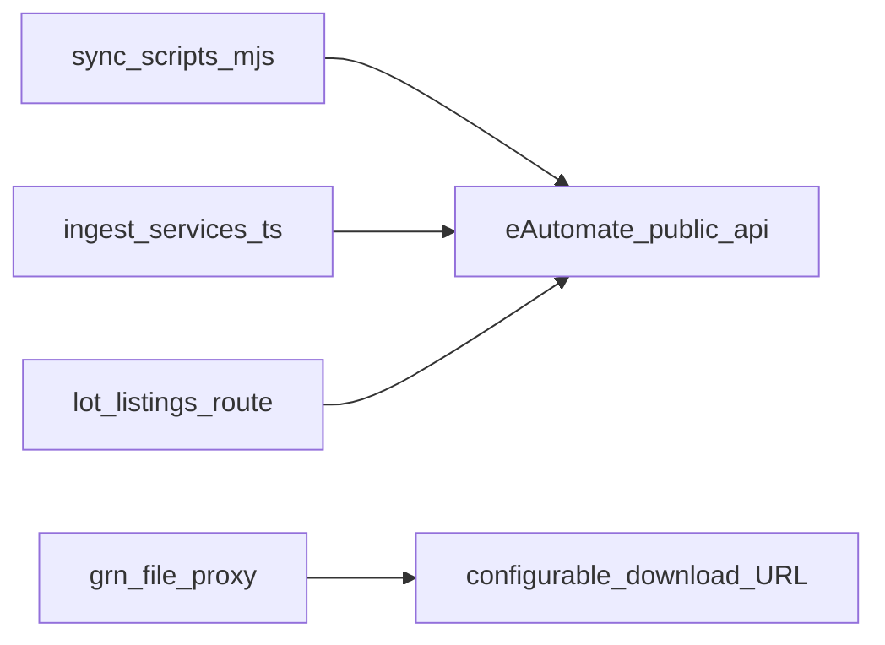

# eAutomate public API reference

**Location:** canonical copy under `web/docs/services/eautomate-integration/`. The same content may still exist at `web/docs/eautomate-public-api-reference.md` for older links — prefer this path.

This document lists every **external** eAutomate endpoint under `{base}/public/api/...` that the Zap `web` package calls (sync scripts, ingest services, lot-listings proxy, and configurable GRN file downloads). Paths are relative to:

`{base}` = `EAUTOMATE_BASE_URL` or default `https://web.eautomate.in` (no trailing slash).

**Scope:** Upstream eAutomate only. Zap’s own `/api/*` routes are not documented here.

---

## Authentication

Zap uses the same pattern in Node sync scripts and in server code (`eautomate-proxy.ts`):

| Mechanism | Environment variable | Header |
|-----------|---------------------|--------|
| Bearer token | `EAUTOMATE_BEARER_TOKEN` | `Authorization: Bearer <token>` |
| Session cookie | `EAUTOMATE_COOKIE` | `Cookie: access_token=…; id_token=…` (same as browser) |
| **Login (refresh)** | `EAUTOMATE_LOGIN_USER_ID` + `EAUTOMATE_LOGIN_PASSWORD` | Zap POSTs `{ userId, password }` to **`/public/api/login`**, builds `EAUTOMATE_COOKIE` from `token` + `id_token` in the JSON body |

Optional overrides for login:

- `EAUTOMATE_LOGIN_URL` — full URL to the login endpoint (if not using default `{EAUTOMATE_BASE_URL}/public/api/login`).
- `EAUTOMATE_LOGIN_PATH` — path only (default `/public/api/login`).

**Automatic refresh:** when login env vars are set, Zap calls login once if there is no cookie yet, and **again after any HTTP 401** from eAutomate (then retries the request once). This covers expired `access_token` (`"Token has expired"`). Sync scripts use `scripts/lib/eautomateAuthFetch.mjs`; the Next server uses `fetchEautomate()` in `eautomate-proxy.ts`.

**Persist back to disk (optional):** set `EAUTOMATE_WRITE_AUTH_TO_ENV_LOCAL=1` to upsert **`EAUTOMATE_COOKIE`**, **`EAUTOMATE_LOGIN_USER_ID`**, and **`EAUTOMATE_LOGIN_PASSWORD`** into `.env.local` (or `EAUTOMATE_ENV_FILE`) **after each successful login**, so the next process sees fresh tokens without copying from the browser. Values are written **double-quoted** for dotenv safety. Intended for **local dev** only (avoid on shared servers).

Typical JSON requests also send:

- `Accept: application/json`
- `Content-Type: application/json` (for POST bodies)

Binary file fetches use `Accept: */*` (see `eautomate-grn-files.ts`).

If neither cookie, bearer, nor login credentials are set, APIs that require auth may return `401`.

---

## Response JSON envelopes (lists / pagination)

Zap parsers do **not** assume a single shape. List endpoints are often handled as:

- Top-level **array** `[ ... ]`, or
- `{ "content": [ ... ] }`, or
- `{ "data": [ ... ] }`

**Vendors — `GET /public/api/vendors/all` additionally accepts:**

- `{ "vendors": [ ... ] }`

Scripts throw or stop if the expected array is missing (see `extractVendorRows` in `sync-eautomate-vendors-all.mjs`).

**Purchase orders — `POST .../purchase_orders/with_filters`:** Zap reads **`data.content`** when paginating (see `sync-eautomate-vendor-pos.mjs`).

All **illustrative** JSON samples below are inferred from field names Zap reads when upserting or ingesting; actual eAutomate payloads may include extra keys or nesting (`vendor`, `data`, etc.). Ingest code often **unwraps** wrapped entities.

---

## Flow (Zap → eAutomate)



---

## `scripts/` coverage (audit)

Every file under `scripts/` was checked for outbound eAutomate HTTP calls.

**Direct `{base}/public/api/...` calls** (only these `.mjs` sync scripts use `fetch`; paths are relative to `{base}/public/api`):

| Script | Method | Path(s) |
|--------|--------|---------|
| `sync-eautomate-vendors-all.mjs` | GET | `/vendors/all` |
| `sync-eautomate-vendor.mjs` | GET | `/vendors/{vendorId}`, `/vendors/listings/{vendorId}` |
| `sync-eautomate-vendors-detail-all.mjs` | GET | `/listings/sku/names`, `/vendors/{vendorId}`, `/vendors/listings/{vendorId}` |
| `sync-eautomate-vendor-pos.mjs` | POST | `/purchase_orders/with_filters` |
| `sync-eautomate-grns.mjs` | POST | `/purchase_orders/grn/all/paginated` |
| `sync-eautomate-grns-pending-audit.mjs` | POST | `/purchase_orders/grn/pending_for_audit/paginated` |
| `sync-eautomate-grns-pending-invoice-collection.mjs` | POST | `/purchase_orders/grn/pending_for_invoice_collection/paginated` |
| `sync-eautomate-pending-debit-credit-notes.mjs` | GET | `/vendors/all` |
| `sync-eautomate-pending-debit-credit-notes.mjs` | POST | `/purchase_orders/grn/debit_credit_notes/paginated` |
| `sync-eautomate-secondary-listings.mjs` | GET | `/inventory/secondary_listings/paginated` |
| `sync-eautomate-secondary-listings.mjs` | POST | `/inventory/secondary_listings/sku_wise_details` |

**TypeScript sync scripts** (same `{base}/public/api/...` pattern; run via `tsx`):

| Script | Method | Path(s) |
|--------|--------|---------|
| `sync-eautomate-outbound-partial-pos.ts` | GET | `/incoming_purchase_orders/partial` |
| `sync-eautomate-outbound-po-detail.ts` | GET | `/incoming_purchase_orders/{po_number}`, `.../fetch_po_detail_files/{po_number}` |
| `sync-eautomate-outbound-consignments.ts` | POST | `/incoming_purchase_orders/consignments/all/paginated` |
| `sync-eautomate-outbound-consignments.ts` | GET | `/incoming_purchase_orders/delivery_locations` |

Query: `search_keyword`, `page`, `count`. Rows upsert into Zap `outbound_purchase_orders` (`id` = eAutomate id, `eautomate_raw` = full JSON). **npm:** `npm run sync:outbound-partial-pos`.

**Outbound PO detail (used by Zap UI + `syncOutboundPurchaseOrderDetailFromEautomate`):**

| Method | Path |
|--------|------|
| GET | `/incoming_purchase_orders/{po_number}` |
| GET | `/incoming_purchase_orders/fetch_po_detail_files/{po_number}` |
| GET | `/incoming_purchase_orders/listings/paginated/{po_number}?search_keyword=&page=1&count=1000` |
| GET | `/incoming_purchase_orders/analytics_object/{po_number}` |

Detail JSON updates `outbound_purchase_orders` including `analytics_object`, `calculated_po_status`, and `eautomate_raw`. File list is stored in `outbound_po_eautomate_files` (`038`). Listings paginated response is stored in `outbound_purchase_orders.listings_snapshot` (`040`). If the detail payload has an empty `analytics_object`, Zap calls `analytics_object/{po_number}` and merges the result before upserting the header row.

**File download proxy:** set server env **`EAUTOMATE_OUTBOUND_PO_FILE_URL_PATH`** (path or full URL) with placeholders `{fileId}` and `{poNumber}` so Zap can stream the binary from eAutomate (same auth cookie/bearer as other proxies). Confirm the exact path in the browser Network tab when downloading from eCraft; Zap returns **501** if unset.

**Indirect** (no `fetch` in script; calls TypeScript ingest services that perform the GETs documented under **Purchase orders and GRN** below — live GRN, PO, vendor, invoice files, per-GRN debit/credit notes, logs, added items, line items, and PO-side listings / `get_by_po_id`, etc.):

| Script | Invokes |
|--------|---------|
| `sync-eautomate-grn-details.ts` | `ingestGrnDetailsByGrnId` in `eautomateGrnDetailsIngestService.ts` |
| `sync-eautomate-grn-details.mjs` | Spawns the `.ts` file via `tsx` (wrapper only) |
| `sync-eautomate-po-details.ts` | `ingestPoDetailsByVendorAndPo` in `eautomatePoDetailsIngestService.ts` |

**No eAutomate HTTP:** `scripts/lib/eautomateVendorUpsert.mjs` (DB upserts only), migration/seed/shell utilities, fixtures JSON.

---

## Vendors

### `GET /public/api/vendors/all`

| | |
|---|---|
| **Full URL** | `{base}/public/api/vendors/all` |
| **Used by** | `scripts/sync-eautomate-vendors-all.mjs`, `scripts/sync-eautomate-pending-debit-credit-notes.mjs` (vendor allowlist) |
| **Query** | _(none)_ |
| **Body** | _(none)_ |

**Response (illustrative vendor element):** Keys Zap normalizes include `id`, `vendor_name` / `name`, `created_by`, `modified_by`, `created_at`, `updated_at`, address fields (`vendor_address_line` / `address` / `vendor_address`), `vendor_city`, `vendor_state`, `vendor_postal_code` / `pin_code`, `vendor_gstin`, `vendor_contact_number`, etc. See `normalizeVendor` in `sync-eautomate-vendors-all.mjs`.

```json
{
  "id": 12345,
  "vendor_name": "Example Vendor Pvt Ltd",
  "created_at": "2025-01-15T10:00:00.000Z",
  "updated_at": "2025-03-01T08:30:00.000Z"
}
```

---

### `GET /public/api/vendors/{vendorId}`

| | |
|---|---|
| **Full URL** | `{base}/public/api/vendors/{vendorId}` |
| **Used by** | `scripts/sync-eautomate-vendor.mjs`, `scripts/sync-eautomate-vendors-detail-all.mjs`, `src/server/services/eautomateGrnDetailsIngestService.ts`, `src/server/services/eautomatePoDetailsIngestService.ts` |
| **Query** | _(none)_ |
| **Body** | _(none)_ |

**Response (illustrative):** Single object or wrapped (`vendor` / `data` merged in ingest). Structure aligns with vendor upsert logic in `sync-eautomate-vendor.mjs`.

---

### `GET /public/api/vendors/listings/{vendorId}`

| | |
|---|---|
| **Full URL** | `{base}/public/api/vendors/listings/{vendorId}` |
| **Used by** | `scripts/sync-eautomate-vendor.mjs`, `scripts/sync-eautomate-vendors-detail-all.mjs`, `src/server/services/eautomatePoDetailsIngestService.ts` |
| **Query** | _(none)_ |
| **Body** | _(none)_ |

**Response:** Array or envelope; PO details ingest normalizes vendor listings for SKU linkage. Exact shape depends on eAutomate.

---

## Listings

### `GET /public/api/listings/sku/names`

| | |
|---|---|
| **Full URL** | `{base}/public/api/listings/sku/names` |
| **Used by** | `scripts/sync-eautomate-vendors-detail-all.mjs`, `src/server/services/eautomatePoDetailsIngestService.ts` |
| **Query** | _(none)_ |
| **Body** | _(none)_ |

**Response:** Global SKU id → name map (cached in `eautomate_sku_names_cache` per migration `030`). Shape is normalized in ingest; often array or wrapped list of `{ sku_id, name, ... }` style entries.

---

## Inventory (secondary listings)

### `GET /public/api/inventory/secondary_listings/paginated`

| | |
|---|---|
| **Full URL** | `{base}/public/api/inventory/secondary_listings/paginated` |
| **Used by** | `scripts/sync-eautomate-secondary-listings.mjs` |
| **Query** | `search_keyword`, `page`, `count` |
| **Body** | _(none)_ |

**Response:** List via top-level array, `content`, or `data`. Rows include `id`, `secondary_sku`, `master_sku`, `inventory_sku_id`, `pack_combo_sku_id`, `sku_type`, `available_quantity`, `ais_quantity`, and may include `secondary_sku_company_details`, `secondary_sku_labels_data`.

### `POST /public/api/inventory/secondary_listings/sku_wise_details`

| | |
|---|---|
| **Full URL** | `{base}/public/api/inventory/secondary_listings/sku_wise_details` |
| **Used by** | `scripts/sync-eautomate-secondary-listings.mjs` (one POST per row after GET) |
| **Query** | _(none)_ |
| **Body** | JSON object: same shape as a paginated row (see illustrative sample below). |

**Illustrative request body** (eAutomate-shaped; nested keys may be filled or empty from GET):

```json
{
  "id": 1208,
  "secondary_sku": "D1001P6C6MSGB527W1",
  "master_sku": "D1001P6C6MSGB527",
  "inventory_sku_id": "NA",
  "pack_combo_sku_id": "D1001P6C6MSGB527",
  "sku_type": "MULTI",
  "available_quantity": -1,
  "secondary_sku_company_details": [
    {
      "company_id": 30044,
      "company_name": "Flipkart Minutes",
      "company_code_primary": "RAKG4NSABXB6APNC"
    }
  ],
  "secondary_sku_labels_data": {
    "secondary_sku": "D1001P6C6MSGB527W1",
    "ean_code": "NA",
    "size": "NA",
    "color": "NA",
    "one_set_contains": "…",
    "mrp": 1199,
    "material": "Assorted"
  }
}
```

**Response:** Often includes `pack_combo_childs[]` (each with `inventory_sku_id`, `sku_count`, nested `listing` including `bins[]`), plus optional `master_sku_listing`, `pack_combo_sku_listing`, `inventory_sku_listing`. Zap stores the **full** JSON body (envelope or flat) in `secondary_listings.sku_wise_details_raw`. The sync script unwraps `data` / `content` when merging into `secondary_listings` columns, and on a successful POST also **upserts** `listings` (images, quantities, `eautomate_bins` from each `listing.bins`) and replaces `pack_combos` for the parent `pack_combo_sku_id` (migration `035`).

**Operational note:** If POST returns **HTTP 500** with a Laravel message such as `storage/logs/laravel.log` permission denied, that is an **eAutomate server configuration** issue. The Zap sync script still **persists the GET paginated row** (including `secondary_sku_company_details` and `secondary_sku_labels_data`) and records the POST error inside `sku_wise_details_raw`. Use `--post-retries` / `--get-only` as documented in the script header.

---

## Purchase orders and GRN

### `POST /public/api/purchase_orders/with_filters`

| | |
|---|---|
| **Full URL** | `{base}/public/api/purchase_orders/with_filters` |
| **Used by** | `scripts/sync-eautomate-vendor-pos.mjs` |
| **Query** | `search_keyword` (often `""`), `page`, `count` |

**Request body** (verbatim from `sync-eautomate-vendor-pos.mjs`; `vendorIds` is an array of numeric vendor ids, e.g. `[123]` for one vendor):

```json
{
  "poNumber": "",
  "vendorIds": [],
  "vendorNames": []
}
```

**Response:** Zap expects paginated content at **`data.content`** (array of PO rows).

**Illustrative row** (fields read in `upsertPo`):

```json
{
  "po_id": 987654,
  "vendor_id": 12345,
  "vendor_name": "Example Vendor",
  "expected_date": "2025-04-01",
  "created_by": "user@example.com",
  "modified_by": "user@example.com",
  "created_at": "2025-01-10T12:00:00.000Z",
  "updated_at": "2025-01-20T15:00:00.000Z",
  "date_published": "2025-01-11T09:00:00.000Z",
  "status": "PENDING",
  "po_remarks": null,
  "sku_count": 10,
  "total_quantity": 1000,
  "number_of_grns": 2,
  "total_invoice_quantity": 950,
  "total_accepted_quantity": 900,
  "total_rejected_quantity": 50,
  "sku_fill_rate": 0.95,
  "quantity_fill_rate": 0.9
}
```

---

### `POST /public/api/purchase_orders/grn/all/paginated`

| | |
|---|---|
| **Full URL** | `{base}/public/api/purchase_orders/grn/all/paginated` |
| **Used by** | `scripts/sync-eautomate-grns.mjs` |
| **Query** | `search_keyword`, `page`, `count` |

**Request body** (verbatim):

```json
{}
```

**Response:** List via top-level array, `content`, or `data` (`extractRows` in `sync-eautomate-grns.mjs`).

**Illustrative GRN row** (fields mapped in `upsertGrn`):

```json
{
  "grn_id": 111,
  "po_id": 987654,
  "vendor_id": 12345,
  "vendor_name": "Example Vendor",
  "grn_status": "COMPLETED",
  "grn_audit_status": "APPROVED",
  "grn_audit_by": "auditor@example.com",
  "grn_invoice_collection_status": "COLLECTED",
  "grn_invoice_collection_by": "user@example.com",
  "vendor_invoice_number": "INV-2025-001",
  "box_count_invoice": 10,
  "actual_box_count_received": 10,
  "grn_sku_count": 5,
  "grn_invoice_quantity": 100,
  "grn_accepted_quantity": 98,
  "grn_rejected_quantity": 2,
  "grn_shortage_quantity": 0,
  "po_sku_count": 10,
  "po_total_quantity": 1000,
  "created_by": "user@example.com",
  "created_at": "2025-02-01T10:00:00.000Z",
  "updated_at": "2025-02-02T11:00:00.000Z"
}
```

Note: API may spell `actual_box_count_recieved` (typo); Zap accepts both.

---

### `POST /public/api/purchase_orders/grn/pending_for_audit/paginated`

| | |
|---|---|
| **Full URL** | `{base}/public/api/purchase_orders/grn/pending_for_audit/paginated` |
| **Used by** | `scripts/sync-eautomate-grns-pending-audit.mjs` |
| **Query** | `search_keyword`, `page`, `count` |

**Request body** (verbatim):

```json
{}
```

**Response:** Same list envelope pattern as `all/paginated`; rows are GRN-shaped like above.

---

### `POST /public/api/purchase_orders/grn/pending_for_invoice_collection/paginated`

| | |
|---|---|
| **Full URL** | `{base}/public/api/purchase_orders/grn/pending_for_invoice_collection/paginated` |
| **Used by** | `scripts/sync-eautomate-grns-pending-invoice-collection.mjs` |
| **Query** | `search_keyword`, `page`, `count` |

**Request body** (verbatim from `FILTER_BODY` in that script):

```json
{
  "grnId": "",
  "poNumber": "",
  "vendorInvoiceNumber": "",
  "vendorIds": [],
  "vendorNames": []
}
```

**Response:** Same list envelope pattern; rows are GRN-shaped.

---

### `POST /public/api/purchase_orders/grn/debit_credit_notes/paginated`

| | |
|---|---|
| **Full URL** | `{base}/public/api/purchase_orders/grn/debit_credit_notes/paginated` |
| **Used by** | `scripts/sync-eautomate-pending-debit-credit-notes.mjs` |
| **Query** | `search_keyword`, `page`, `count` |

**Request body** (verbatim from `FILTER_BODY` in that script):

```json
{
  "grnId": "",
  "poNumber": "",
  "vendorInvoiceNumber": "",
  "vendorIds": [],
  "vendorNames": []
}
```

**Response:** List via array, `content`, or `data` (`extractRows`).

**Illustrative note row** (fields mapped in `insertNoteRow`; note id field is `id` in API):

```json
{
  "id": 555001,
  "grn_id": 111,
  "po_id": 987654,
  "credit_debit_note_type": "DEBIT",
  "credit_debit_note_status": "PENDING",
  "credit_debit_note_number": "DBN-2025-01",
  "credit_debit_note_number_assignment_status": "ASSIGNED",
  "credit_debit_note_upload_status": "UPLOADED",
  "credit_debit_note_uploaded_by": "user@example.com",
  "reverse_credit_debit_note_number": null,
  "reverse_credit_debit_note_upload_status": null,
  "reverse_credit_debit_note_uploaded_by": null,
  "created_by": "user@example.com",
  "created_at": "2025-02-05T09:00:00.000Z",
  "updated_at": "2025-02-06T10:00:00.000Z",
  "grn_status": "COMPLETED",
  "grn_audit_status": "APPROVED",
  "grn_audit_by": "auditor@example.com",
  "vendor_invoice_number": "INV-2025-001",
  "box_count_invoice": 10,
  "actual_box_count_received": 10,
  "vendor_id": 12345,
  "vendor_name": "Example Vendor"
}
```

---

### `GET /public/api/purchase_orders/lot-listings/with-search-keyword`

| | |
|---|---|
| **Full URL** | `{base}/public/api/purchase_orders/lot-listings/with-search-keyword` |
| **Used by** | `src/app/api/inbound/lot-listings/route.ts` (server proxy to eAutomate) |
| **Query** | `search_keyword`, `page`, `count` |
| **Body** | _(none)_ |

**Response:** Forwarded JSON from eAutomate (Inbound SKU Wise View). Zap returns the same status/body as the upstream response after auth.

---

### `GET /public/api/purchase_orders/{poId}`

| | |
|---|---|
| **Full URL** | `{base}/public/api/purchase_orders/{poId}` |
| **Used by** | `eautomateGrnDetailsIngestService.ts`, `eautomatePoDetailsIngestService.ts` |
| **Query** | _(none)_ |
| **Body** | _(none)_ |

**Response:** PO header object (possibly wrapped); ingest reads fields such as `vendor_id` / `vendorId`, dates, `created_by` / `createdBy`, etc.

---

### `GET /public/api/purchase_orders/addedItems/withListing/{poId}`

| | |
|---|---|
| **Full URL** | `{base}/public/api/purchase_orders/addedItems/withListing/{poId}` |
| **Used by** | `eautomatePoDetailsIngestService.ts` |
| **Query** | _(none)_ |
| **Body** | _(none)_ |

**Response:** Added line items for the PO (with listing info). Stored in `inbound_po_detail_lines` / related ingest paths.

---

### `GET /public/api/purchase_orders/addedItems/withListing/withPendency/{poId}`

| | |
|---|---|
| **Full URL** | `{base}/public/api/purchase_orders/addedItems/withListing/withPendency/{poId}` |
| **Used by** | `eautomateGrnDetailsIngestService.ts` |
| **Query** | _(none)_ |
| **Body** | _(none)_ |

**Response:** Added items with pendency; persisted as `inbound_grn_added_items` for the GRN ingest flow.

---

### `GET /public/api/purchase_orders/grn/get_by_po_id/{poId}`

| | |
|---|---|
| **Full URL** | `{base}/public/api/purchase_orders/grn/get_by_po_id/{poId}` |
| **Used by** | `eautomatePoDetailsIngestService.ts` |
| **Query** | _(none)_ |
| **Body** | _(none)_ |

**Response:** GRN list / objects associated with the PO; used when ingesting PO details (`inbound_po_detail_grns`).

---

### `GET /public/api/purchase_orders/grn/{grnId}`

| | |
|---|---|
| **Full URL** | `{base}/public/api/purchase_orders/grn/{grnId}` |
| **Used by** | `eautomateGrnDetailsIngestService.ts` |
| **Query** | _(none)_ |
| **Body** | _(none)_ |

**Response:** Live GRN header from eAutomate; merged into `inbound_grn_detail_snapshot` (`grn_api_raw` and related fields).

---

### `GET /public/api/purchase_orders/grn/invoice_files/{grnId}`

| | |
|---|---|
| **Full URL** | `{base}/public/api/purchase_orders/grn/invoice_files/{grnId}` |
| **Used by** | `eautomateGrnDetailsIngestService.ts` |
| **Query** | _(none)_ |
| **Body** | _(none)_ |

**Response:** List of invoice file metadata (ids, names, upload info, URLs); stored in `inbound_grn_invoice_files`.

---

### `GET /public/api/purchase_orders/grn/debit_credit_notes/{grnId}`

| | |
|---|---|
| **Full URL** | `{base}/public/api/purchase_orders/grn/debit_credit_notes/{grnId}` |
| **Used by** | `eautomateGrnDetailsIngestService.ts` |
| **Query** | _(none)_ |
| **Body** | _(none)_ |

**Response:** Notes and nested files for one GRN; stored in `inbound_grn_debit_credit_notes` and `inbound_grn_debit_credit_note_files`.

---

### `GET /public/api/purchase_orders/grn/logs/{grnId}`

| | |
|---|---|
| **Full URL** | `{base}/public/api/purchase_orders/grn/logs/{grnId}` |
| **Used by** | _(not used by Zap ingest)_ — GRN activity rows in `inbound_grn_logs` are appended by Zap when users perform actions. |
| **Query** | _(none)_ |
| **Body** | _(none)_ |

**Note:** This endpoint may still exist on eAutomate for reference; Zap does **not** sync its response into Postgres. **Illustrative** response shape (legacy):

**Illustrative log element:**

```json
{
  "log_id": 9001,
  "log_type": "AUDIT",
  "operation_performed": "Quantity updated",
  "po_id": 987654,
  "vendor_id": 12345,
  "foreign_key": null,
  "sku_id": "SKU-123",
  "invoice_quantity": 100,
  "accepted_quantity": 98,
  "rejected_quantity": 2,
  "received_price": 12.5,
  "remarks": "Partial acceptance",
  "created_by": "user@example.com",
  "created_at": "2025-02-03T14:00:00.000Z",
  "updated_at": "2025-02-03T14:05:00.000Z"
}
```

---

### `GET /public/api/purchase_orders/grn/items/withListing/{grnId}`

| | |
|---|---|
| **Full URL** | `{base}/public/api/purchase_orders/grn/items/withListing/{grnId}` |
| **Used by** | `eautomateGrnDetailsIngestService.ts` |
| **Query** | _(none)_ |
| **Body** | _(none)_ |

**Response:** GRN line items with listing info; stored in `inbound_grn_items`.

---

## GRN file download (binary)

Not a fixed path in code: URLs are built from **environment templates** in `src/server/eautomate-grn-files.ts`.

| Env variable | Purpose |
|--------------|---------|
| `EAUTOMATE_GRN_INVOICE_FILE_URL_PATH` | Invoice file download template |
| `EAUTOMATE_GRN_DCN_FILE_URL_PATH` | Debit/credit note file download template |

Placeholders: `{fileId}`, `{grnId}`, `{noteId}`.

**Documented examples** (path only or full URL):

- `/public/api/purchase_orders/grn/invoice_file/{fileId}/download`
- `/public/api/purchase_orders/grn/debit_credit_note_file/{fileId}/download`

| | |
|---|---|
| **Method** | `GET` |
| **Headers** | Same auth as above; `Accept: */*` |
| **Response** | Binary stream (e.g. PDF), not JSON — `Content-Type` / `Content-Disposition` from eAutomate |

Zap’s secured proxy: `GET /api/inbound/grns/{grnId}/files/{fileId}?kind=invoice|debit_note` (and `noteId` when `kind=debit_note`) resolves the template server-side before fetching eAutomate.

---

## Source index (implementation references)

| Area | Files |
|------|--------|
| Base URL & headers | `src/server/eautomate-proxy.ts` |
| GRN file URL templates | `src/server/eautomate-grn-files.ts` |
| GRN detail ingest GETs | `src/server/services/eautomateGrnDetailsIngestService.ts` |
| PO detail ingest GETs | `src/server/services/eautomatePoDetailsIngestService.ts` |
| Lot listings proxy | `src/app/api/inbound/lot-listings/route.ts` |
| Sync: GRN details (ingest) | `scripts/sync-eautomate-grn-details.ts`, `scripts/sync-eautomate-grn-details.mjs` |
| Sync: PO details (ingest) | `scripts/sync-eautomate-po-details.ts` |
| Sync: vendors all | `scripts/sync-eautomate-vendors-all.mjs` |
| Sync: vendor + listings | `scripts/sync-eautomate-vendor.mjs`, `scripts/sync-eautomate-vendors-detail-all.mjs` |
| Shared vendor DB upsert | `scripts/lib/eautomateVendorUpsert.mjs` (no HTTP) |
| Sync: vendor POs | `scripts/sync-eautomate-vendor-pos.mjs` |
| Sync: GRNs | `scripts/sync-eautomate-grns.mjs` |
| Sync: pending audit / invoice collection | `scripts/sync-eautomate-grns-pending-audit.mjs`, `scripts/sync-eautomate-grns-pending-invoice-collection.mjs` |
| Sync: pending debit/credit notes | `scripts/sync-eautomate-pending-debit-credit-notes.mjs` |
| Sync: secondary listings | `scripts/sync-eautomate-secondary-listings.mjs` |
| Env examples | `.env.local.example` |

---

## Internal mirror (Zap API)

Zap exposes many **internal** REST routes that mirror or wrap data already in Postgres; those are described separately in [`postman/Zap-API.postman_collection.json`](../../../postman/Zap-API.postman_collection.json). They are **not** eAutomate upstream calls.
