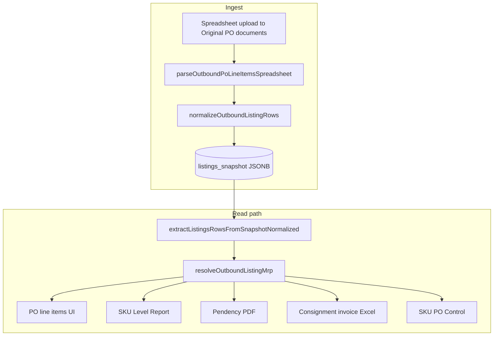

# PO listing commercial field repair

**Audience:** Operations, outbound engineers  
**Related:** [Outbound journey](../../outbound-journey.md), [Pendency PDF](pendency-pdf.md), [Sync runbook](../../operations/sync-runbook.md)

---

## Summary

Blinkit and similar vendor PO spreadsheets often put **commas inside product titles** (inch marks, colors). Naive CSV splitting shifted columns so:

| Expected field | Corrupted value |
|----------------|-----------------|
| `title` | Truncated at `"` or missing inch mark |
| `rate_without_tax` | Color text (`Black & Golden)(Box)`) |
| `tax_rate` | Actual unit rate (`127.12`) |
| `demand` | GST % (`18`) instead of order qty |
| `color` | Empty |

Bad rows were stored in `outbound_purchase_orders.listings_snapshot` and affected the PO line-items UI, SKU report, pendency PDF, invoice Excel, SKU PO Control, and PO analytics.

---

## Data flow

See also: [Original PO document spreadsheet ingest](po-document-spreadsheet-ingest.md), [EAN mappings import](ean-mappings-import.md).



---

## Normalization rules

Implementation: [`outboundListingNormalize.ts`](../../src/server/utils/outboundListingNormalize.ts)

`normalizeOutboundListingRow(row)` returns `{ row, repaired, repairs }`.

### Detection

1. **Embedded CSV in title** — title contains `)(Box),127.12,18,6,...` (unquoted upload).
2. **Column shift** — `rate_without_tax` has letters, `tax_rate` looks like a price (> 28 or > MRP).

### Repair steps

1. Unpack or merge title fragments (inch marks, colors).
2. Restore `rate_without_tax` from shifted `tax_rate`.
3. Restore `tax_rate` from shifted `demand` when value is a valid GST % (5/12/18/28), with special handling when qty and GST are both `5`.
4. Recover `demand` from `margin`, `total_amount`, or (misaligned only) `warehouse_quantity`.
5. Infer GST from MRP vs rate when needed (`rate × 1.05 ≈ MRP` → 5% GST).
6. Extract `color` from title patterns like `", Black & Golden)(Box)"`.
7. Fix missing inch quote: `(6.2, Black` → `(6.2", Black`.

### Developer rule

**Always** use `extractListingsRowsFromSnapshotNormalized(snapshot)` for commercial fields. Do not read raw `listings_snapshot` rows for rates, tax, or demand.

---

## MRP vs landing rate

Blinkit vendor spreadsheets expose separate columns:

| Column | Meaning | Example (SKU 10314301) |
|--------|---------|--------------------------|
| `Landing Rate` | Inclusive landed unit price | 150 |
| `MRP` | Retail MRP printed on label | 1099 |

When columns shift during CSV ingest, **MRP can be overwritten with the landing rate** (e.g. `mrp: 150`). SKU/EAN mappings (`company_ean_mappings`) resolve **master SKU / EAN**, not MRP.

### MRP resolution chain

Implementation: `resolveOutboundListingMrp()` in [`outboundPurchaseOrdersService.ts`](../../src/server/services/outboundPurchaseOrdersService.ts)

1. **PO spreadsheet** — use snapshot `mrp` when it is plausible retail MRP (not ≈ landing/inclusive rate).
2. **Labels secondary** — `labels_master_data` joined via `secondary_listings` on `po_secondary_sku`.
3. **Labels master** — same table joined on resolved `master_sku` from EAN mappings.
4. **Unresolved** — flagged in Preview line items; ops should re-parse the vendor XLSX or add labels master data.

`mrpLooksLikeLandingRate()` treats a value as suspicious when it is close to `landing_rate` or `rate × (1 + GST%)`, unless `mrp >= landing_rate × 1.5` (plausible retail markup).

### Preview line items transparency

PO Actions → **Preview line items** shows per row:

- **PO MRP** — raw value from snapshot
- **MRP** — resolved value used in SKU report
- **Source** — `PO`, `Labels (secondary)`, `Labels (master)`, or `Unresolved`

Rows with replaced or unresolved MRP appear under **Issues only**.

---

## Surfaces covered

| Surface | Normalization |
|---------|----------------|
| Spreadsheet upload / PO create | Yes — auto-applied on upload |
| PO line items API + UI | Yes — via normalized extract |
| SKU Level Report XLSX | Yes — caller passes normalized rows |
| PO Actions — Preview line items | Yes — modal before SKU report download |
| Pendency PDF | Yes |
| Consignment invoice Excel | Yes |
| SKU PO Control matrix | Yes |
| Consignment packing preview / upload | Yes |
| PO analytics rollup | Yes — on ingest and backfill |
| Consignment items `raw` JSONB | Backfill script with `--sync-consignment-items` |

---

## CSV parsing

Shared RFC 4180 parser: [`csvParse.ts`](../../src/server/utils/csvParse.ts)

Used by:

- PO line-item spreadsheet parse
- Consignment packing spreadsheet parse

PO CSV also **rejoins** cells between `Product Description` and `Basic Cost Price` when unquoted commas split the title.

**Prefer XLSX upload** when the vendor file has inch marks; XLSX avoids comma-splitting entirely.

---

## Operations runbook

### After deploying this fix

1. **Backfill open POs** (dry-run first):

   ```bash
   cd web
   npm run repair:outbound-po-listings -- --dry-run
   npm run repair:outbound-po-listings
   ```

2. **Single PO** (e.g. Blinkit PO `1735810041652`):

   ```bash
   npm run repair:outbound-po-listings -- --po-number 1735810041652
   ```

3. **Include consignment item raw JSONB**:

   ```bash
   npm run repair:outbound-po-listings -- --sync-consignment-items
   ```

4. **All POs** (including closed):

   ```bash
   npm run repair:outbound-po-listings -- --all
   ```

5. **Re-parse from stored Original PO document** (restores full row count + correct MRP from XLSX):

   ```bash
   # Uses analytics_object.listings_source_attachment_id after a UI "Use as line items" apply
   npm run repair:outbound-po-listings -- --po-number 1735810041652 --reparse-from-source

   # Or explicit attachment id from outbound_po_attachments
   npm run repair:outbound-po-listings -- --po-number 1735810041652 --reparse-from-attachment 42
   ```

   Add `--dry-run` to print intent without writing. Combine with `--sync-consignment-items` to refresh consignment `raw` JSONB.

### Re-upload (UI)

On the PO detail page, **Add PO document** with the vendor XLSX — line items update on upload. See [po-document-spreadsheet-ingest.md](po-document-spreadsheet-ingest.md).

### Upload API

`POST …/attachments` returns `parseResult` and optional `parseWarning` for spreadsheets.

EAN mapping import uses separate preview/apply routes — see [ean-mappings-import.md](ean-mappings-import.md).

### Verification checklist

For a repaired PO:

1. PO line items expanded row: title, color, MRP, rate, tax % correct.
2. PO actions preview + SKU report: MRP is retail (1099 not 150 for SKU 10314301); source column shows `PO` or `Labels`.
3. SKU report: no color text in `rate_without_tax`.
4. Pendency PDF: pending qty ≠ GST %.
5. `analytics_object` commercial totals plausible; `listings_source_filename` points at vendor XLSX.

---

## Known limits

- eAutomate API may return pre-truncated titles; repair is best-effort at read time.
- Severely corrupted rows with no `total_amount` / `margin` / qty hints may remain flagged (`stillMisaligned > 0`).
- `warehouse_quantity` on misaligned rows may be shifted qty or bin stock; recovery uses it only during misalignment repair.

---

## Tests

- [`outbound-po-listing-normalize.test.ts`](../../tests/unit/outbound-po-listing-normalize.test.ts) — edge cases from PO `1735810041652`
- [`outbound-po-listing-spreadsheet.test.ts`](../../tests/unit/outbound-po-listing-spreadsheet.test.ts) — quoted/unquoted CSV ingest
- [`outbound-po-document-spreadsheet.test.ts`](../../tests/unit/outbound-po-document-spreadsheet.test.ts) — golden XLSX fixture (17 rows, MRP 1099)
- [`outbound-po-listings-preview.test.ts`](../../tests/unit/outbound-po-listings-preview.test.ts) — preview + MRP source
- [`outbound-listing-mrp.test.ts`](../../tests/unit/outbound-listing-mrp.test.ts) — MRP resolution chain
- [`outbound-po-sku-report.test.ts`](../../tests/unit/outbound-po-sku-report.test.ts) — XLSX export columns
- [`ean-mappings-import.test.ts`](../../tests/unit/ean-mappings-import.test.ts) — CSV import preview/apply
