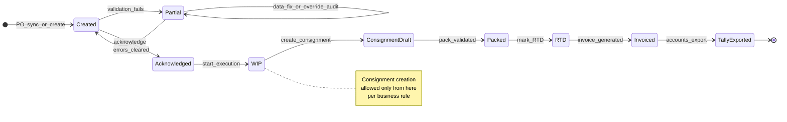

# Warehouse + Inventory + PO → Dispatch → Accounting — Phased implementation plan

This document is the **source-of-truth plan** for implementing the end-to-end pipeline in a **phased manner**. It combines the operational pipeline, **validation gates**, identified gaps, and how **eCraft Zap (web)** fits alongside the **warehouse app**, **eAutomate**, and **Tally / accounts**.

**Related docs**

- [database-schema.md](./database-schema.md) — PostgreSQL tables and columns  
- [eautomate-public-api-reference.md](./eautomate-public-api-reference.md) — upstream HTTP paths Zap uses  
- [project-features-modules.md](./project-features-modules.md) — Zap product modules overview  
- [../mobile/docs/ui-professionalization-plan.md](../mobile/docs/ui-professionalization-plan.md) — warehouse app UI workstream (parallel)

**Code anchors (this monorepo)** — use when splitting tickets:

| Area | Location |
|------|----------|
| Outbound PO detail UI | `web/src/app/(app)/(logistics)/outbound/outbound-po-detail-client.tsx` |
| Outbound PO line items table | `web/src/app/(app)/(logistics)/outbound/outbound-po-detail-line-items-table.tsx` |
| Partial outbound POs | `web/src/app/(app)/(logistics)/outbound/partial/` |
| Outbound consignments | `web/src/app/(app)/(logistics)/outbound/consignments/` |
| PO detail API + sync | `web/src/app/api/outbound/purchase-orders/[id]/detail/route.ts` |
| Stub eAutomate actions | `web/src/app/api/outbound/purchase-orders/[id]/eautomate-actions/route.ts` |
| Detail sync (eAutomate) | `web/src/server/services/eautomateOutboundPoDetailSyncService.ts` |
| Outbound PO service / upsert | `web/src/server/services/outboundPurchaseOrdersService.ts` |

---

## Table of contents

1. [North star](#1-north-star)  
2. [High-level pipeline](#2-high-level-pipeline)  
3. [State machine (visual)](#3-state-machine-visual)  
4. [Detailed workflow](#4-detailed-workflow-clarified)  
5. [eAutomate ↔ Zap status mapping (initial)](#5-eautomate--zap-status-mapping-initial)  
6. [Standard error payload](#6-standard-error-payload-for-apis--ui)  
7. [Data outputs](#7-data-outputs-from-consignment)  
8. [Zap scope in this plan](#8-zap-web--scope-in-this-plan)  
9. [Gaps and risks](#9-gaps-and-risks-track-explicitly)  
10. [Validation catalog](#10-validation-catalog-implement-in-phases)  
11. [Phased roadmap](#11-phased-implementation-roadmap)  
12. [Sequencing](#12-sequencing-recommendation-order-of-attack)  
13. [RACI (lightweight)](#13-raci-lightweight)  
14. [Non-goals](#14-non-goals-scope-boundary)  
15. [First sprint checklist](#15-immediate-checklist-first-sprint)  
16. [Document control](#16-document-control)

---

## 1. North star

- **Single documented state machine** for outbound (mirror rules for inbound where relevant), shared by **eCraft Zap (web)**, **warehouse app**, and **eAutomate**, with **explicit validation** at each transition and **auditable** changes (who / when / what).
- **Server-enforced rules** for every transition; client UI only reflects and explains. Never rely on UI-only checks for business gates.
- **Outcome:** fewer “partial PO + manual backend” surprises; clear **PO → WIP → Consignment → Pack → RTD → Invoice → Tally** ownership; **migration-safe** inventory initialization.
- **Sync principle:** eAutomate remains **source of truth** for upstream PO/consignment data until Zap owns a mutation; Zap may **annotate** (errors, UI state) without contradicting mastered numbers without a defined merge rule.

---

## 2. High-level pipeline

```
Purchase Order (PO)
   ↓
Acknowledged
   ↓
Work in Progress (WIP)
   ↓
Consignment Creation
   ↓
Box / Packing Upload (App or Excel)
   ↓
Ready To Dispatch (RTD)
   ↓
Invoice Generation
   ↓
Tally / Accounts Integration
```

---

## 3. State machine (visual)



---

## 4. Detailed workflow (clarified)

### 4.1 Purchase Order (PO)

- **Created** manually, via upload, or synced from channel / eAutomate.
- **Contains (minimum):** item codes (SKU), quantities, GST / pricing, locations, parties as applicable.

#### Edge case: partial PO creation

**When it happens (examples):**

- SKU missing or not resolvable against listing / master data.
- **GST mismatch** (e.g. 5% on listing vs 18% on PO line).
- Price / HSN / inactive listing mismatches.

**Policy:**

- Partial is a **first-class state** with a structured **`errors[]`** (not only a `PARTIAL` label).
- **No silent partials:** every blocking issue is enumerated for ops and for sync consumers.
- Resolution path: **data fix** (catalog/listing/PO line) and/or **audited override** (role + reason), then resubmit / advance.

### 4.2 PO states (canonical)

| Stage | Meaning | Signals |
|--------|---------|--------|
| **Created** | PO exists; may still fail validation | Data entry / sync complete |
| **Partial** | PO persisted but blocked by validation | Structured `errors[]` |
| **Acknowledged** | Ops commits to execute | “Team started working” |
| **Work in Progress** | Execution in flight | Packing, consignments, allocations |
| **Consignment / Pack / RTD** | Shipment batch lifecycle | See §3 diagram |
| **Invoiced / Accounts** | Financial handoff | Tally export, pending invoices cleared |

**Engineering note:** maintain an explicit **mapping table** (doc or code constant) from eAutomate fields such as `po_creation_status`, `po_acknowledgement_status`, `po_fulfillment_status`, `is_wip`, `calculated_po_status` → the canonical stages above. Today Zap stores multiple columns; the UI must not invent a fifth meaning.

### 4.3 Consignment creation

- **Rule:** consignment **only** when PO is **Work in Progress** (or equivalent approved state).
- **Represents:** one **shipment batch** for that PO (multiple consignments over time if the business allows split shipments).

### 4.4 Packing (critical step)

**Option A — App-based**

- Real-time packing, box-level lines, optional offline queue **only** if conflict resolution when sync reconnects is defined.

**Option B — Excel / template upload**

- Download **versioned** template.
- Fill: box number, SKU mapping, quantity per box / line.
- Upload → validate → sync.

**Current reality (stakeholder calls):**

- Often **Excel-driven** or **manual**; app adoption incomplete.
- **Plan:** support both paths via **one shared validation layer** (BFF or shared server module) so Zap uploads and the app use identical rules.

### 4.5 Validation issues (operational)

- Invalid **box / master carton** names (not in master list or regex).
- **SKU mismatch** vs PO lines.
- **Quantity inconsistencies** (over demand, negative pending, bad sums).
- Duplicate rows / duplicate box+SKU in same batch (policy-defined).

### 4.6 RTD (Ready to dispatch)

- Triggered when packing / checks are complete per business rules.
- **Typically required:** transporter, vehicle number (and docket if policy requires).
- **After RTD:** shipment treated as finalized for dispatch; invoice generation can proceed.

### 4.7 Invoice + accounting

- Invoice generated **post RTD** (or per agreed rule).
- Export to **Tally** (or intermediate file); **accounts** owns final reconciliation.
- **Pending invoices** list is the operational bridge to accounts.

---

## 5. eAutomate ↔ Zap status mapping (initial)

This table is a **working hypothesis** for alignment work in **Phase A2**; adjust after ops sign-off against live eCraft screens.

| eAutomate / DB concept | Typical Zap / UI meaning | Canonical stage (§4.2) |
|------------------------|--------------------------|-------------------------|
| `po_creation_status = PARTIAL` | Validation incomplete | **Partial** |
| `po_creation_status = COMPLETED` (and no blockers) | PO structurally complete | **Created** or later |
| `po_acknowledgement_status` e.g. ACKNOWLEDGEMENT-PENDING | Awaiting acknowledge | **Created** |
| After acknowledge action | Ops started | **Acknowledged** |
| `is_wip = YES` | Execution | **WIP** |
| `calculated_po_status` e.g. ACKNOWLEDGEMENT PENDING | Derived headline for user | Display only unless mapped to gates |
| Consignment row exists | Shipment batch | **Consignment** subtree |
| RTD timestamps / status on consignment | Ready to dispatch | **RTD** |
| Invoice assigned (e.g. green in UI) | Accounts path | **Invoiced** |

**Quantities (single definition for UI + validation):**

- **Demand** — from PO line (`demand` in listings API / synced snapshot).  
- **Dispatched** — `dispatched_quantity` (and in-app events when wired).  
- **Packed** — explicit field when upstream provides it; else derive from pack upload totals.  
- **Pending** — `max(0, demand - dispatched - packed_reserved)` per agreed formula; document the exact formula in A2 and reuse everywhere.

---

## 6. Standard error payload (for APIs + UI)

All transition and upload endpoints should converge on:

```json
{
  "ok": false,
  "errors": [
    {
      "code": "GST_MISMATCH",
      "message": "PO line tax 18% does not match listing 5%.",
      "field": "lines[3].tax_rate",
      "severity": "block"
    }
  ],
  "allowedTransitions": ["retry_validation", "request_override"],
  "correlationId": "uuid-for-support"
}
```

**UI rule:** disable buttons using `allowedTransitions`; tooltips use first `block` severity `message` or a summarized count.

---

## 7. Data outputs (from consignment)

- Packing list: **box-wise** and **SKU-wise**.
- Invoice and **PO mapping** (which PO / consignment / lines).
- Dispatch details (transporter, vehicle, timestamps).

---

## 8. Zap (web) — scope in this plan

Zap is a **structured layer**: catalogs, listings (primary + secondary), inventory logs, **outbound PO + consignments**, vendor + GRN, pending invoices / credit notes, plugin-style extensibility.

**Zap responsibilities in this plan**

- **Surface** PO state, **blocking errors**, **next allowed actions** (disable with tooltip + server reason).
- **Consignment** list/detail filtered by PO; link pack uploads and RTD readiness.
- **Strict validation** on any Zap-native mutations (uploads, overrides) aligned with the same rules as the app when APIs are shared.
- **Today:** outbound PO detail includes listings snapshot sync and **stub** POST `.../eautomate-actions` (501) until real eAutomate paths are captured — replace in **Phase C4** with contracted calls only.

---

## 9. Gaps and risks (track explicitly)

| Gap | Risk | Mitigation in this plan |
|-----|------|-------------------------|
| **App dependency** | Ops stuck if app behavior unclear | Phased docs + videos; shared validation API; Zap read-only parity first |
| **Too many manual steps** | Excel / backend fixes / errors | Validation spec + batch error reports + audited overrides |
| **Broken flow understanding** | “Structure without connected dots” | Phase A living process doc + state matrix |
| **Inventory initialization** | Old dump vs new real-time drift | **Phase E** freeze + reconciliation + rollback (not Phase D) |
| **Stub actions** | Users think features work | Clear 501 copy + doc until wired; feature-flag “strict” mode |

### Risk register (review monthly)

| ID | Risk | Likelihood | Impact | Mitigation |
|----|------|------------|--------|------------|
| R1 | eAutomate API differs per tenant / version | Med | High | Capture Network HAR per env; version env config |
| R2 | Duplicate sync writers (script + UI) | Med | Med | Single upsert path where possible; idempotent keys |
| R3 | Partial PO override without audit | Low | High | Force `reason` + role in B1 |

---

## 10. Validation catalog (implement in phases)

**Principle:** every transition returns **machine-readable errors** (`code`, `message`, `field`, `severity`) where applicable; UI maps to human copy.

### 10.1 PO intake (create / upload / sync)

| Rule | Severity | Note |
|------|----------|------|
| SKU resolves to listing / secondary listing | Block | Configurable strictness |
| GST / tax vs master | Block or override | Override = role + reason + audit |
| Quantity integer > 0 | Block | |
| Sum / channel constraints | Block / warn | Per business |
| Partial PO cannot Ack until resolved | Block | Unless override workflow exists |

### 10.2 Acknowledge → WIP

| Rule | Severity |
|------|----------|
| RBAC (ops role) | Block |
| Idempotent transition | — |
| No acknowledge if blocking validation | Block |

### 10.3 Consignment

| Rule | Severity |
|------|----------|
| PO must be WIP | Block |
| Allocated qty ≤ open demand (per SKU / PO) | Block |

### 10.4 Packing (Excel + app)

| Rule | Severity |
|------|----------|
| Template **version** present and known | Block |
| Box name in **whitelist** / master | Block (row-level errors) |
| Per-line qty ≤ remaining for SKU scope | Block |
| No duplicate box+SKU in batch (if policy) | Warn / block |

### 10.5 RTD

| Rule | Severity |
|------|----------|
| Transporter + vehicle (if required) | Block |

### 10.6 Invoice / Tally export

| Rule | Severity |
|------|----------|
| Schema version + row count + totals match | Block export |
| GSTIN / HSN where legally required | Block |

### 10.7 Overrides

| Rule | Severity |
|------|----------|
| Authenticated + reason + audit trail | — |

---

## 11. Phased implementation roadmap

Phases are **sequential in intent** but some work can overlap (e.g. docs + Zap UI in parallel). Adjust durations with your team.

### Phase A — Connect the dots (cross-functional, ~1–2 weeks)

| # | Deliverable | Owner | Done when |
|---|-------------|-------|-----------|
| A1 | **Living process doc**: one diagram — PO → … → Tally; per arrow: system, trigger, API/event, failure, rollback | Product + Eng | Reviewed by ops lead |
| A2 | **State & data dictionary**: map eAutomate fields ↔ Zap DB ↔ UI labels; single definition of demand / pending / packed / dispatched | Eng | Mapping table merged into this doc §5 or linked appendix |
| A3 | **Partial PO playbook**: causes, resolution, who can override | Product + Ops | Linked from Zap partial PO screen (`/outbound/partial`) |

**Exit criteria:** a new engineer can explain the full flow in 10 minutes using A1–A3 only.

---

### Phase B — Validation design + API contracts (~1–2 weeks)

| # | Deliverable | Done when |
|---|-------------|-----------|
| B1 | **Validation spec** (this doc §10) implemented as **error codes** + stable message keys | |
| B2 | **Transition API** (or extend `GET .../detail`): `allowedTransitions`, `blockingErrors` on PO detail payload | Zap + app consume same JSON shape |
| B3 | **Postman / examples** updated ([Zap-API.postman_collection.json](../postman/Zap-API.postman_collection.json)) | |

**Exit criteria:** first **consignment-from-WIP-only** gate enforced on server with at least one automated test.

---

### Phase C — Zap (web) implementation (~2–4 weeks, incremental)

| # | Deliverable | Done when |
|---|-------------|-----------|
| C1 | PO detail: **state**, **errors**, **next actions** (disabled + tooltip from server) | Uses §6 payload |
| C2 | Consignments: **filter by PO** (`?search=`), show pack / RTD / invoice readiness columns or badges | |
| C3 | Partial PO: **structured error list** + link to playbook (A3) | |
| C4 | Replace **501 stubs** in `eautomate-actions` **only after** Network-tab contracts + env config documented | |

**Exit criteria:** ops can complete a **read-only** review of a PO path in Zap without asking engineering for field meaning.

---

### Phase D — Warehouse app + shared backend (~parallel to C, depends on team)

| # | Deliverable | Done when |
|---|-------------|-----------|
| D1 | Pack upload / app events call **same validation** as Zap | |
| D2 | Template **version** + batch error UX | |
| D3 | RTD form validation aligned with §10.5 | |

**Exit criteria:** one golden-path **App** run and one **Excel** run produce the same persisted pack state (verified by query or API).

---

### Phase E — Inventory initialization & migration (~2–3 weeks, can start after B)

| # | Deliverable | Done when |
|---|-------------|-----------|
| E1 | **Cutover runbook**: freeze window, baseline dump, delta rules | |
| E2 | **Reconciliation job**: sum(bins) vs expected; discrepancy report | |
| E3 | **Rollback** procedure documented | |

**Exit criteria:** one dry-run migration on staging with signed-off reconciliation.

---

### Phase F — Testing, training, hardening (~ongoing)

| # | Deliverable | Done when |
|---|-------------|-----------|
| F1 | **Golden-path E2E**: PO → Ack → WIP → Consignment → pack → RTD → invoice stub | Automated or scripted QA |
| F2 | **Negative tests** for each §10 gate | CI or manual checklist |
| F3 | **Short videos** per role (ops, warehouse, accounts) | Linked from internal wiki + [project-features-modules.md](./project-features-modules.md) if appropriate |

**Exit criteria:** stakeholder sign-off on “happy path + top 5 failure paths”.

---

## 12. Sequencing recommendation (order of attack)

1. **Phase A** — removes “dots not connected” confusion fastest.  
2. **Phase B** — consignment + pack gates (largest operational pain).  
3. **Phase C** — Zap surfaces errors + next actions (reduces manual backend).  
4. **Phase E** — inventory migration (parallel if fiscal calendar pressure is real).  
5. **Phase D** — app parity once APIs and rules are stable.

---

## 13. RACI (lightweight)

| Workstream | Responsible | Accountable | Consulted | Informed |
|------------|-------------|-------------|-----------|----------|
| State machine & playbook (A) | Eng | Product | Ops, Accounts | Leadership |
| Validation & APIs (B) | Eng | Eng lead | Ops | Accounts |
| Zap UI (C) | Eng | Product | Ops | — |
| App + pack (D) | Mobile eng | Ops lead | Eng | Accounts |
| Inventory cutover (E) | Eng + Ops | Finance | Accounts | Leadership |
| Training videos (F) | Ops | Product | Eng | All users |

---

## 14. Non-goals (scope boundary)

- Replacing Tally or full ERP ledger logic inside Zap.  
- Owning **source** packing truth in Zap **before** shared validation rules exist (avoid divergent Excel vs app math).  
- Real-time vehicle GPS or transporter marketplace integrations (unless explicitly added later).  
- Changing eAutomate authorization model (document current: cookie / bearer / login refresh per [eautomate-public-api-reference.md](./eautomate-public-api-reference.md)).

---

## 15. Immediate checklist (first sprint)

- [ ] Assign owner for **A1 process doc** (single file, versioned).  
- [ ] Schedule **30 min** with ops to validate **state names** vs eCraft UI (fill §5).  
- [ ] List **3 partial PO** real examples; extract **error patterns** for B1.  
- [ ] Capture **eAutomate Network** requests for: Acknowledge, RTD, invoice download (for C4).  
- [ ] Add **one** automated test: “cannot create consignment unless WIP” (first place consignment is created: Zap API, eAutomate proxy, or app backend — pick the earliest gate).  
- [ ] Link this doc from [project-features-modules.md](./project-features-modules.md) outbound subsection (one line).

---

## 16. Document control

| Version | Date | Author | Notes |
|---------|------|--------|------|
| 1.0 | 2026-04-16 | Planning | Initial consolidated plan |
| 1.1 | 2026-04-16 | Planning | TOC, repo anchors, §5 mapping, §6 error JSON, mermaid state, RACI, non-goals, risk register, Phase D/E fix in gaps table, Postman pointer, quantity definitions |

**Review cadence:** update at the end of each phase when exit criteria are met, or when eAutomate / Tally contracts change.
